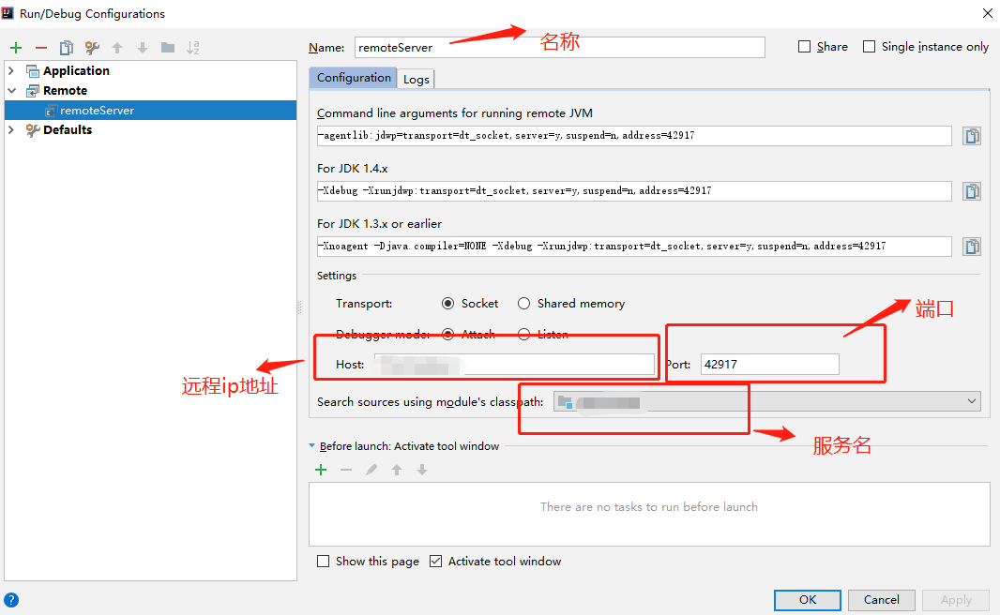

# ✅IDEA如何做远程Debug？

# 典型回答


在 IntelliJ IDEA 中进行远程调试，需要先启动应用程序并在需要进行调试的代码处设置断点，然后按照以下步骤进行设置：


1. 在 IntelliJ IDEA 中选择“Run”菜单，选择“Edit Configurations”。


2. 在左侧面板中选择“Remote”，然后点击“+”按钮添加一个新的配置。


3. 在弹出的对话框中，为新配置设置一个名称，并设置远程的Host和Port


4. 点击“OK”保存配置。


接下来，在命令行中启动应用程序，指定远程调试端口号，并等待 IntelliJ IDEA 连接。在 IntelliJ IDEA 中点击“Debug”按钮启动调试器，此时应用程序应该停在第一个断点处。





并且，远程服务也需要支持debug才行，需要配置如下信息：


1.5-1.8

```plain
-agentlib:jdwp=transport=dt_socket,server=y,suspend=y,address=8000
```


1.9以后

```plain
agentlib:jdwp=transport=dt_socket,server=y,suspend=y,address=*:8000
```


> 原文: <https://www.yuque.com/hollis666/xkm7k3/ly0b136ncfbam618>