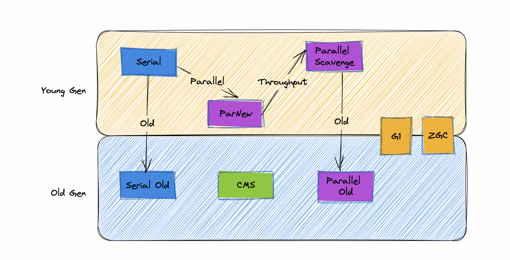

# ✅新生代和老年代的垃圾回收器有何区别？

# 典型回答

常见的垃圾回收器如下：

1.  串行垃圾回收器（Serial Garbage Collector） 如：Serial GC， Serial Old
2.  并行垃圾回收器（Parallel Garbage Collector） 如：Parallel Scavenge，Parallel Old，ParNew
3.  并发标记扫描垃圾回收器（CMS Garbage Collector） 
4.  G1垃圾回收器（G1 Garbage Collector，JDK 7中推出，JDK 9中设置为默认） 
5. ZGC垃圾回收器（The Z Garbage Collector，JDK 11 推出）

**新生代收集器有Serial、ParNew、Parallel Scavenge；**

**老年代收集器有Serial Old、Parallel Old、CMS。**

**整堆收集器有G1、ZGC**

# 扩展知识
## 串行垃圾收集器
### Serial GC
**Serial是单线程的串行垃圾回收器，主要采用**`**标记-复制算法**`**进行垃圾回收。**

****

单线程地好处就是减少上下文切换，减少系统资源的开销。但这种方式的缺点也很明显，在GC的过程中，必须暂停其他所有的工作线程，直至Serial收集器收集结束为止（Stop The World）。若GC不是频繁发生，这或许是一个不错的选择，否则将会影响程序的执行性能。 

### Serial Old

**Serial Old是Serial的老年代版本，也是个单线程收集器，适用于老年代，使用的是**`**标记-整理算法**`**。**

****

优缺点基本和Serial差不多，二者主要是回收算法不一样。

## 并行垃圾收集器
### ParNew

**ParNew其实就是Serial的多线程版本，在参数、回收算法上，和****Serial是完全一样的，所以他也是采用**`**标记-复制算法**`**进行垃圾回收的。**

ParNew在垃圾回收的时候，同样会STW，但是因为它是多线程并行进行垃圾回收的，所以通常情况下时间会比Serial短一些。

### Parallel Scavenge

**Parallel Scavenge 也是一个新生代的垃圾回收器，和ParNew一样，他也是多线程并行执行的，同样采用的也是**`**标记-复制算法**`。与ParNew最大的不同是，Parallel Scavenge 关注的是垃圾回收的吞吐量（吞吐量=代码运行时间/(代码运行时间+垃圾收集时间)，以吞吐量优先。

因为Parallel Scavenge收集器的高吞吐量可以最高效率的利用CPU时间，尽快的完成程序的运算任务等，所以他主要适合在后台运算，比如一些定时任务的执行。

### Parallel Old
**Parallel 是 Parallel Scavenge的老年代版本，同样是一个关注吞吐量的并行垃圾收集器，他采用的是**`**标记-整理算法**`**算法进行垃圾回收的。**

## CMS

CMS，Concurrent Mark Sweep，同样是老年代的收集器。他也是一个并发执行的垃圾收集器，他和Parallel最大的区别是他更加关注垃圾回收的停顿时间，通过他的名字Concurrent Mark Sweep就可以知道，他采用的是耗时更短的`**标记-清除算法**`。

[✅介绍下CMS的垃圾回收过程](https://www.yuque.com/hollis666/xkm7k3/lh75qbvh58o6xv8s)

## 并发回收与并行回收

[✅说一说JVM的并发回收和并行回收](https://www.yuque.com/hollis666/xkm7k3/srfo2k1o2nq4dp7f)

## G1
[简单介绍一下G1垃圾收集器？](https://www.yuque.com/hollis666/xkm7k3/hgquufzt6m9psmtp)

## ZGC

[JDK 11中新出的ZGC有什么特点？](https://www.yuque.com/hollis666/xkm7k3/qpu0uu6em1ompzeh)

> 原文: <https://www.yuque.com/hollis666/xkm7k3/nqra2l>