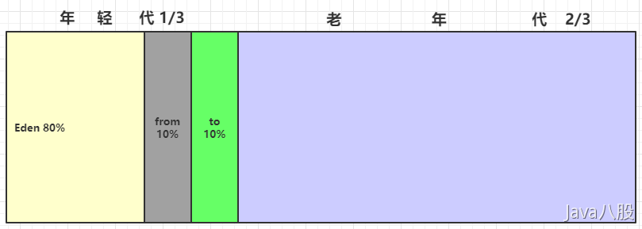
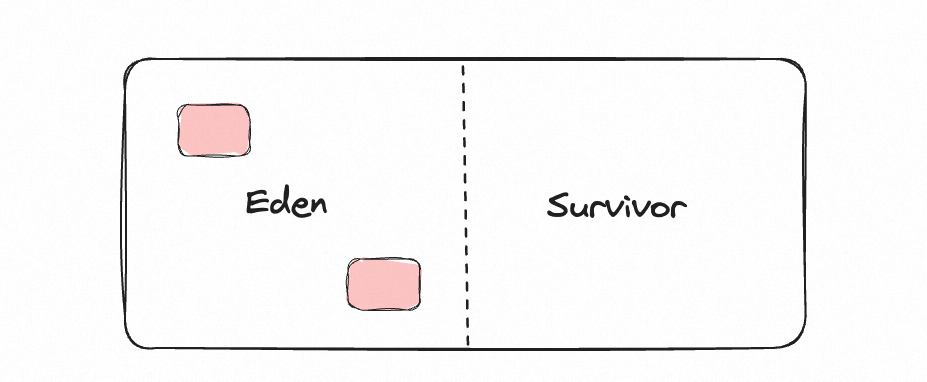

# ✅新生代如果只有一个Eden+一个Survivor可以吗？

**答案是不行，如果只有两个区域，也能实现复制算法，但是会大大浪费空间。**

我们知道，新生代进一步区分了一个Eden区和2个Survivor区，一共有Eden Survivor From、Survivor To这三个区域，那么，为什么需要三个区域呢？2个行不行呢？

这其实涉及到新生代的垃圾回收算法了：

[新生代和老年代的GC算法](https://www.yuque.com/hollis666/xkm7k3/batkyxxf61dx4kl7)

根据默认配置，新生代有一个 Eden区，两个survivor区，eden区占80%内存空间，每一块survivor区占 10%

因为新生代主要使用的是`标记-复制`算法进行垃圾回收的。 刚开始对象都分配在Eden区，如果Eden区快满了就触发垃圾回收，把Eden区中的存活对象转移到一块空着的survivor区，eden区清空，然后再次分配新对象到eden区，再触发垃圾回收，就把eden区存活的和survivor区存活的转移到另一块空着的survivor。

那么也就是说，在平常的时候，新生代的区域中是只有一块eden和一块survivor区在被使用的，而另一块Survivor区是空着的，所以内存使用率大约 90%。

如果没有三个区域，只有两个，比如只有一个Eden和一个Survivor：

如果此时Eden区进行YoungGC之后，会如下图所示：

那么，接下来继续创建对象的时候，如果继续向Eden分配：

如果之后进行第二次YoungGC的时候，就不能只扫描Eden区，还要扫描Survivor区。那么，就不能使用标记复制算法了，因为标记复制算法的要求是必须有一块区域是空着的。

而如果使用标记-清除算法或者标记-整理算法的话，就会存在碎片和效率等问题。

那么，如果改一下，从Eden复制到Survivor之后，再次分配新对象的时候分配到Survivor呢？然后Survivor满了再把对象复制到Eden，这样循环往复？

这样做，或许可以实现复制算法了，但是带来的问题就是两个区域都会承担新对象的分配工作，那么他的内存就都得足够大，那么就要分配成1：1，这样的话，整个新生代的同一时刻只能有1/2的空间被使用，利用率很低。

# 扩展知识

## Survivor不够怎么办？

在YoungGC之后，如果存活的对象所需要的空间比Survivor区域的空间大怎么办呢？毕竟一块Survivor区域的比例只是年轻的10%而已。

**这时候就需要把对象移动到老年代。**

****

### 空间分配担保机制

如果Survivor区域的空间不够，就要分配给老年代，也就是说，老年代起到了一个兜底的作用。但是，老年代也是可能空间不足的。所以，在这个过程中就需要做一次**空间分配担保（CMS）：**

在每一次执行YoungGC之前，**虚拟机会检查老年代最大可用的连续空间是否大于新生代所有对象的总空间。**

**如果大于**，那么说明本次Young GC是安全的。

**如果小于**，那么虚拟机会查看`HandlePromotionFailure` 参数设置的值判断是否允许担保失败。如果值为true，那么会继续检查老年代最大可用连续空间是否大于历次晋升到老年代的对象的平均大小（一共有多少对象在内存回收后存活下来是不可预知的，因此只好取之前每次垃圾回收后晋升到老年代的对象大小的平均值作为参考）。如果大于，则尝试进行一次YoungGC，但这次YoungGC依然是有风险的；如果小于，或者HandlePromotionFailure=false，则会直接触发一次Full GC。

**但是，需要注意的是**`**HandlePromotionFailure**`**这个参数，在JDK 7中就不再支持了**：

在JDK代码中，移除了这个参数的判断（[https://github.com/openjdk/jdk/commit/cbc7f8756a7e9569bbe1a38ce7cab0c0c6002bf7](https://github.com/openjdk/jdk/commit/cbc7f8756a7e9569bbe1a38ce7cab0c0c6002bf7) ），也就是说，在后续的版本中， 只要检查老年代最大可用连续空间是否大于历次晋升到老年代的对象的平均大小，如果大于，则认为担保成功。

但是需要注意的是，担保的结果可能成功，也可能失败。所以，在YoungGC的复制阶段执行之后，会发生以下三种情况：

+ 剩余的存活对象大小，小于Survivor区，那就直接进入Survivor区。
+ 剩余的存活对象大小，大于Survivor区，小于老年代可用内存，那就直接去老年代。
+ 剩余的存活对象大小，大于Survivor并且大于老年代，触发"FullGC"。

> 原文: <https://www.yuque.com/hollis666/xkm7k3/eigm8iqgpwmd2eg8>