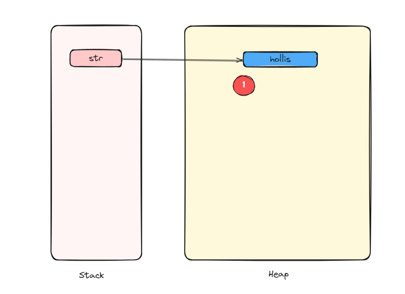
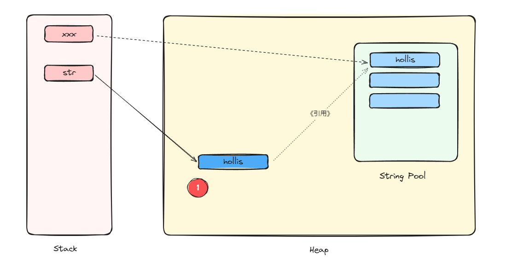

# ✅String str=new String("hollis")创建了几个对象？

# 典型回答
创建的对象数应该是1个或者2个。


首先要清楚什么是对象？


Java是一种面向对象的语言，而Java对象在JVM中的存储也是有一定的结构的，在HotSpot虚拟机中，存储的形式就是oop-klass model，即Java对象模型。我们在Java代码中，使用new创建一个对象的时候，JVM会创建一个instanceOopDesc对象，这个对象中包含了两部分信息，对象头以及元数据。对象头中有一些运行时数据，其中就包括和多线程相关的锁的信息。元数据其实维护的是指针，指向的是对象所属的类的instanceKlass。


这才叫对象。其他的，一概都不叫对象。


那么不管怎么样，一次new的过程，都会在堆上创建一个对象，那么就是起码有一个对象了。至于另外一个对象，到底有没有要看具体情况了。





另外这一个对象就是常量池中的字符串常量，这个字符串其实是类编译阶段就进到Class常量池的，然后在运行期，字符串常量在第一次被调用(准确的说是ldc指令)的时候，进行解析并在字符串池中创建对应的String实例的。


[✅什么是Class常量池，和运行时常量池关系是什么？](https://www.yuque.com/hollis666/xkm7k3/orlw1aoulz0dhxr8)


[✅字符串常量是什么时候进入到字符串常量池的？](https://www.yuque.com/hollis666/xkm7k3/os0m38kyugpxvgsq)


在运行时常量池中，也并不是会立刻被解析成对象，而是会先以JVM_CONSTANT_UnresolveString_info的形式驻留在常量池。在后面，该引用第一次被LDC指令执行到的时候，就尝试在堆上创建字符串对象，并将对象的引用驻留在字符串常量池中。


通过看上面的过程，你也能发现，这个过程的触发条件是我们没办法决定的，问题的题干中也没提到。有可能执行这段代码的时候是第一次LDC指令执行，也许在前面就执行过了。

****

**所以，如果是第一次执行，那么就是会同时创建两个对象。一个字符串常量引用指向的对象，一个我们new出来的对象。**

****


****

**如果不是第一次执行，那么就只会创建我们自己new出来的对象。**

****




至于有人说什么在字符串池内还有在栈上还有一个引用对象，你听听这说法，引用就是引用。别往对象上面扯。


# 扩展知识


## 字面量和运行时常量池


JVM为了提高性能和减少内存开销，在实例化字符串常量的时候进行了一些优化。为了减少在JVM中创建的字符串的数量，字符串类维护了一个字符串常量池。


在JVM运行时区域的方法区中，有一块区域是运行时常量池，主要用来存储**编译期**生成的各种**字面量**和**符号引用**。


了解Class文件结构或者做过Java代码的反编译的朋友可能都知道，在java代码被`javac`编译之后，文件结构中是包含一部分`Constant pool`的。比如以下代码：


```plain
public static void main(String[] args) {
    String s = "Hollis";
}
```


经过编译后，常量池内容如下：


```plain
 Constant pool:
   #1 = Methodref          #4.#20         // java/lang/Object."<init>":()V
   #2 = String             #21            // Hollis
   #3 = Class              #22            // StringDemo
   #4 = Class              #23            // java/lang/Object
   ...
   #16 = Utf8               s
   ..
   #21 = Utf8               Hollis
   #22 = Utf8               StringDemo
   #23 = Utf8               java/lang/Object
```


上面的Class文件中的常量池中，比较重要的几个内容：


```plain
   #16 = Utf8               s
   #21 = Utf8               Hollis
   #22 = Utf8               StringDemo
```


上面几个常量中，`s`就是前面提到的**符号引用**，而`Hollis`就是前面提到的**字面量**。而Class文件中的常量池部分的内容，会在运行期被运行时常量池加载进去。关于字面量，详情参考[Java SE Specifications](https://docs.oracle.com/javase/specs/jls/se8/html/jls-3.html#jls-3.10.5)

## intern


**编译期**生成的各种**字面量**和**符号引用**是运行时常量池中比较重要的一部分来源，但是并不是全部。那么还有一种情况，可以在运行期向运行时常量池中增加常量。那就是`String`的`intern`方法。


当一个`String`实例调用`intern()`方法时，Java查找常量池中是否有相同Unicode的字符串常量，如果有，则返回其的引用，如果没有，则在常量池中增加一个Unicode等于str的字符串并返回它的引用；


**intern()有两个作用，第一个是将字符串字面量放入常量池（如果池没有的话），第二个是返回这个常量的引用。**


### intern的正确用法


不知道，你有没有发现，在`String s3 = new String("Hollis").intern();`中，其实`intern`是多余的？


因为就算不用`intern`，Hollis作为一个字面量也会被加载到Class文件的常量池，进而加入到运行时常量池中，为啥还要多此一举呢？到底什么场景下才需要使用`intern`呢？


在解释这个之前，我们先来看下以下代码：


```plain
    String s1 = "Hollis";
    String s2 = "Chuang";
    String s3 = s1 + s2;
    String s4 = "Hollis" + "Chuang";
```


在经过反编译后，得到代码如下：


```plain
    String s1 = "Hollis";
    String s2 = "Chuang";
    String s3 = (new StringBuilder()).append(s1).append(s2).toString();
    String s4 = "HollisChuang";
```


可以发现，同样是字符串拼接，s3和s4在经过编译器编译后的实现方式并不一样。s3被转化成`StringBuilder`及`append`，而s4被直接拼接成新的字符串。


如果你感兴趣，你还能发现，`String s3 = s1 + s2;` 经过编译之后，常量池中是有两个字符串常量的分别是 `Hollis`、`Chuang`（其实`Hollis`和`Chuang`是`String s1 = "Hollis";`和`String s2 = "Chuang";`定义出来的），拼接结果`HollisChuang`并不在常量池中。


究其原因，是因为常量池要保存的是**已确定**的字面量值。也就是说，对于字符串的拼接，纯字面量和字面量的拼接，会把拼接结果作为常量保存到字符串池。


如果在字符串拼接中，有一个参数是非字面量，而是一个变量的话，整个拼接操作会被编译成`StringBuilder.append`，这种情况编译器是无法知道其确定值的。只有在运行期才能确定。


那么，有了这个特性了，`intern`就有用武之地了。那就是很多时候，我们在程序中得到的字符串是只有在运行期才能确定的，在编译期是无法确定的，那么也就没办法在编译期被加入到常量池中。


这时候，对于那种可能经常使用的字符串，使用`intern`进行定义，每次JVM运行到这段代码的时候，就会直接把常量池中该字面值的引用返回，这样就可以减少大量字符串对象的创建了。


如一[深入解析String#intern](https://tech.meituan.com/in_depth_understanding_string_intern.html)文中举的一个例子：


```plain
static final int MAX = 1000 * 10000;
static final String[] arr = new String[MAX];

public static void main(String[] args) throws Exception {
    Integer[] DB_DATA = new Integer[10];
    Random random = new Random(10 * 10000);
    for (int i = 0; i < DB_DATA.length; i++) {
        DB_DATA[i] = random.nextInt();
    }
    long t = System.currentTimeMillis();
    for (int i = 0; i < MAX; i++) {
         arr[i] = new String(String.valueOf(DB_DATA[i % DB_DATA.length])).intern();
    }

    System.out.println((System.currentTimeMillis() - t) + "ms");
    System.gc();
}
```


在以上代码中，我们明确的知道，会有很多重复的相同的字符串产生，但是这些字符串的值都是只有在运行期才能确定的。所以，只能我们通过`intern`显示的将其加入常量池，这样可以减少很多字符串的重复创建。


### intern原理


[✅String中intern的原理是什么？](https://www.yuque.com/hollis666/xkm7k3/yr32wu44yxt5l8nh)


> 原文: <https://www.yuque.com/hollis666/xkm7k3/em12e4rgw6suv75o>