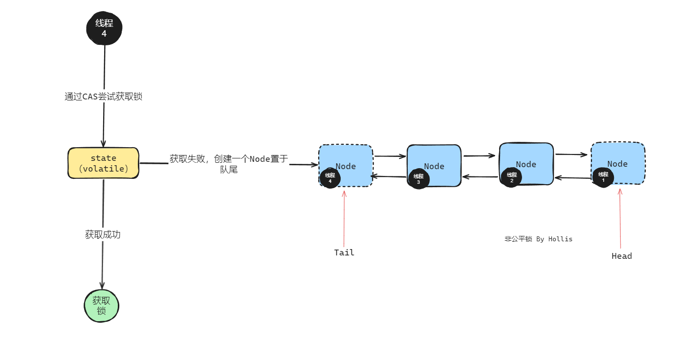
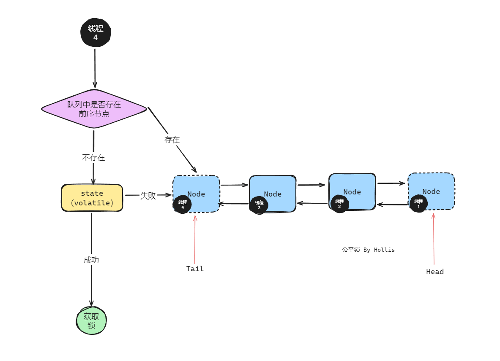

# ✅公平锁和非公平锁的区别？

# 典型回答
+ **非公平锁**：多个线程**不按照申请锁的顺序**去获得锁，而是直接去尝试获取锁，获取不到，再进入队列等待，如果能获取到，就直接获取到锁。




+ **公平锁**：多个线程**按照申请锁的顺序**去获得锁，所有线程都在队列里排队，这样就保证了队列中的第一个先得到锁。





两种锁分别适合不同的场景中，存在着各自的优缺点，**对于公平锁来说，他的优点是所有的线程都能得到资源，不会饿死在队列中。但是他存在着吞吐量会下降很多，队列里面除了第一个线程，其他的线程都会阻塞，cpu唤醒阻塞线程的开销会很大的缺点。**


而**对于非公平锁来说，他可以减少CPU唤醒线程的开销，整体的吞吐效率会高点，CPU也不必去唤醒所有线程，会减少唤起线程的数量。但是他可能会导致队列中排队的线程一直获取不到锁或者长时间获取不到锁，活活饿死的情况。**


# 扩展知识
ReentrantLock 分为公平锁和非公平锁，可以通过构造方法来指定具体类型：


```plain
//默认非公平锁
public ReentrantLock() {
	sync = new NonfairSync();
}
```


```plain
//公平锁
public ReentrantLock(boolean fair) {
	sync = fair ? new FairSync() : new NonfairSync();
}
```


默认一般使用**非公平锁**，它的效率和吞吐量都比公平锁高的多。


## <font style="color:rgb(0, 0, 0);">reentrantLock的非公平锁实现</font>


非公平锁的lock的核心逻辑在NonfairSync中，具体代码如下：


```plain
/**
 * Sync object for non-fair locks
 */
static final class NonfairSync extends Sync {
    private static final long serialVersionUID = 7316153563782823691L;

    /**
     * Performs lock.  Try immediate barge, backing up to normal
     * acquire on failure.
     */
    final void lock() {
        if (compareAndSetState(0, 1))
            setExclusiveOwnerThread(Thread.currentThread());
        else
            acquire(1);
    }

    protected final boolean tryAcquire(int acquires) {
        return nonfairTryAcquire(acquires);
    }
}

```

[  
](https://blog.csdn.net/weixin_39309402/article/details/106466843)

从代码里可以看出，lock方法执行的时候会先用cas来判断当前锁是否有线程在占用，如果cas成功，也就是成功将1设到state上去了的话，那么当时锁是没有线程在占用的，那么最后会执行将当前线程设到AbstractOwnableSynchronizer中。


也就是说，在非公平锁中，如果有线程尝试获取锁的时候，不会直接排队，而是先通过CAS尝试获取锁，获取到了就直接用， 获取不到再排队。

## <font style="color:rgb(0, 0, 0);">reentrantLock的公平锁实现</font>
公平锁的lock的核心逻辑在FairSync中，具体代码如下：


```plain

/**
 * Sync object for fair locks
 */
static final class FairSync extends Sync {
    private static final long serialVersionUID = -3000897897090466540L;

    final void lock() {
        acquire(1);
    }

    /**
     * Fair version of tryAcquire.  Don't grant access unless
     * recursive call or no waiters or is first.
     */
    protected final boolean tryAcquire(int acquires) {
        final Thread current = Thread.currentThread();
        int c = getState();
        if (c == 0) {
            if (!hasQueuedPredecessors() &&
                compareAndSetState(0, acquires)) {
                setExclusiveOwnerThread(current);
                return true;
            }
        }
        else if (current == getExclusiveOwnerThread()) {
            int nextc = c + acquires;
            if (nextc < 0)
                throw new Error("Maximum lock count exceeded");
            setState(nextc);
            return true;
        }
        return false;
    }
}
```


公平锁的lock方法在进行cas判断时多了一个`hasQueuedPredecessors`的判断，它会在AQS队列中没有线程的情况下才会申请锁，而不像非公平锁一样，非公平锁一来不管AQS里是否有排队的线程就直接申请锁。


> 原文: <https://www.yuque.com/hollis666/xkm7k3/bnt978>