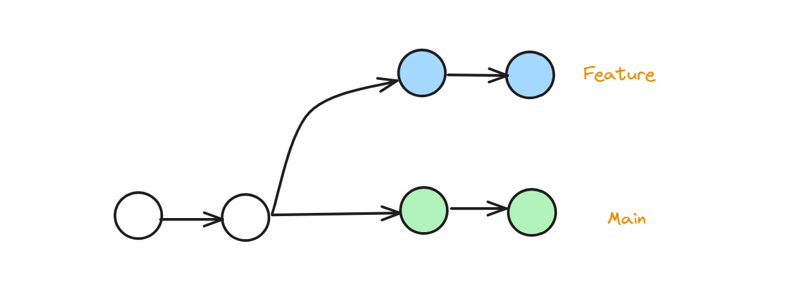

# ✅Git的merge和rebase有什么区别？

# 典型回答


在Git中，merge和rebase是两种不同的代码合并策略，它们用于将一个分支的更改合并到另一个分支。它们的主要区别在于合并的方式和提交历史的表现上


在介绍区别之前，我们先看下当我们从主干（Main）创建了一个新的分支（Feature）开始开发代码时，然后另外有人把自己的代码提交到主干（Main）之后，就会产生分叉的提交记录。





这时候你想把你的代码也提交到主干中，就有两个选择了：merge(合并)，rebase(变基)


## merge


```java
git checkout feature
git merge main
```


```java
git merge feature main
```


以上两种都是把一个主干(main)的最新代码合并(merge)到分支(featrue)的方式。


这个操作会在分支中创建一个新的“merge commit”，它将两个分支的更改合并到一个新的提交中。


如上图，就是我们把Main中的新提交Merge到我们的Feature分支中。


### rebase


作为merge的替代方法，您可以使用以下命令将功能分支重新设置为主分支：


```java
git checkout main
git rebase feature
```


这会将整个main移动到feature分支的顶端，从而有效地将所有新提交合并到 feature 中。但是，rebase不是使用merge commit，而是通过为原始分支中的每个提交创建全新的提交来重写项目历史记录。


如上图，就是我们将Main中新的提交，通过rebase的方式合并到我们的Feature分支中。


### 总结下区别


当我们想要把一个分支合并到主干的时候，merge操作会通过merge commit的方式在主干上新建一个节点，并一次性的把分支中的修改合并到主干中。它的优点是分支代码合并后不破坏原分支的代码提交记录，缺点就是会产生额外的提交记录并进行两条分支的合并。


而rebase操作，不会在主干上新建节点，而是把分支上的所有历史提交都合并到主干中，形成一个完成的线性提交记录。他的优点是无须新增提交记录到目标分支，rebase后可以将对象分支的提交历史续上目标分支上，形成线性提交历史记录，进行review的时候更加直观。


所以，merge rebase可以保留完整的历史提交记录。


当你想要保留原始分支的提交历史，并且不介意在合并中产生额外的合并提交时，可以使用merge。在多人协作或公共分支上，merge是一个更安全和常见的选择，因为它保留了每个开发者的提交历史，易于跟踪和回溯。


当你想要保持提交历史的整洁、线性，并且愿意改写提交历史时，可以使用rebase。在个人开发分支上，为了保持提交历史的简洁和易于阅读，rebase用的更多。


一般来说，在公司内部做团队开发，使用merge的情况会更多一些，我在工作中基本上90%的时间都是使用merge的


# 扩展知识


## 不建议在公共分支做rebase


一般来说，我们在工作中的开发模式都是**基于分支开发，基于主干发布**的模式。什么意思呢？


就是仓库中有一份主干的代码，线上运行的就是这套代码，当我们有需求要开发的时候，不会直接在主干上开发，而是基于主干拉一个分支出来，在分支中进行开发，开发好之后，再把这个分支的代码通过发布的方式合并到主干中。


在业内有一个**rebase黄金法则**：**不要对已经提交到共享仓库（如远程仓库）的提交执行 rebase。**


为什么要遵守这个黄金法则呢？


rebase会将所有的Main分支上的提交移动到Feature分支的顶端，问题是这个操作只发生在你自己的本地仓库中，所有的其他开发者是完全不感知的，因为他们是使用旧的Main分支创建的分支。


这时候如果我们的Feature变更被推送到远程仓库后，其他人的Feature想要在提交的时候，就会产生大量的冲突。


所以，在多人协作中，应该遵循以下指导原则：

1. 在个人开发分支上进行 rebase：如果你在个人开发分支上进行 rebase，这不会对其他开发者产生影响，因为这个分支只属于你个人。
2. 在共享仓库的主分支上使用 merge：在共享仓库的主分支（如 master 或 main）上，推荐使用 merge 来将开发的功能或修复合并回主分支。这样可以保留每个开发者的提交历史，易于跟踪和回溯。
3. 协作时协商：如果有特殊情况需要在共享仓库的分支上进行 rebase，应该与其他开发者进行充分协商，并确保大家都知道并同意这个变更。


> 原文: <https://www.yuque.com/hollis666/xkm7k3/lgsmdz60lxsni6v1>