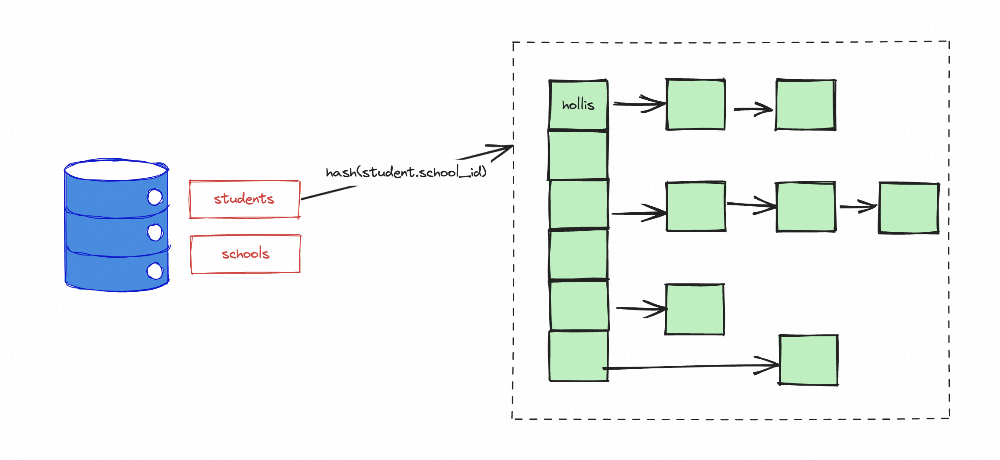
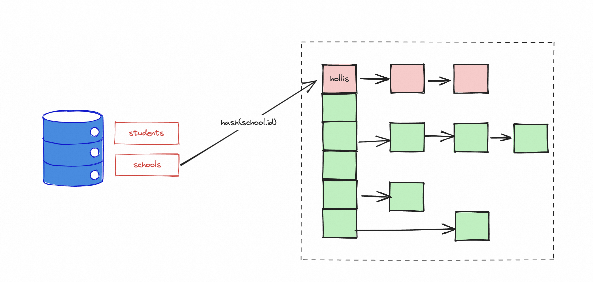
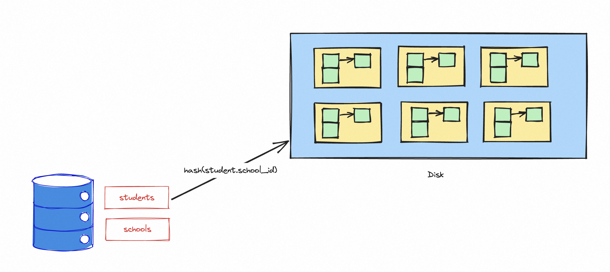
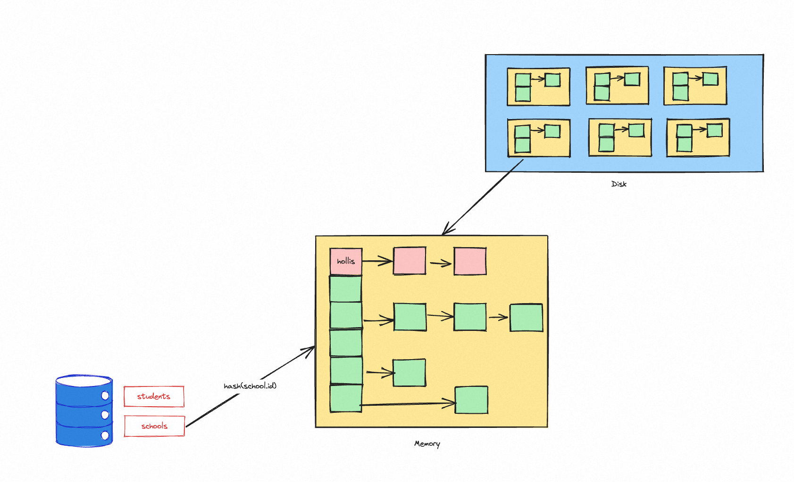

# ✅MySQL的Hash Join是什么？

# 典型回答


hash join<font style="color:rgb(34, 34, 34);"> 是 MySQL 8.0.18版本中新推出的一种多表join的算法。</font>


在这之前，MySQL是使用了嵌套循环（Nested-Loop Join）的方式来实现关联查询的，而嵌套循环的算法其实性能是比较差的，而Hash Join的出现就是要优化Nested-Loop Join的。


[✅为什么大厂不建议使用多表join？](https://www.yuque.com/hollis666/xkm7k3/qt4krg)


**所谓Hash Join，其实是因为他底层用到了Hash表。**

****

Hash Join 是一种针对 equal-join 场景的优化，他的基本思想是将驱动表数据加载到内存，并建立 hash 表，这样只要遍历一遍非驱动表，然后再去通过哈希查找在哈希表中寻找匹配的行<font style="color:rgb(55, 65, 81);background-color:rgb(247, 247, 248);"> </font>，就可以完成 join 操作了。


举个栗子。


```plain
SELECT
  student_name,school_name
FROM
  students LEFT JOIN schools ON students.school_id=schools.id;
```


以上，是一个left join的SQL，**在Hash Join过程中，主要分为两个步骤，分别是构建和探测**。


构建阶段，假如优化器优化后使用students作为驱动表，那么就会把这个驱动表的数据构建到hash表中：





探测阶段，在这个过程中，从school表中取出记录之后，去hash表中查询，找到匹配的数据，在做聚合就行了。





需要注意的时候，上面的Hash表是在内存中的，但是，内存是有限的（通过join_buffer_size限制），如果内存中存不下驱动表的数据怎么办呢？

# <font style="color:rgb(85, 85, 85);">扩展知识</font>


## 基于磁盘的hash join


如果驱动表中的数据量比较大， 没办法一次性的加载到内存中，就需要考虑把这些数据存储在磁盘上。通过将哈希表的一部分存储在磁盘上，分批次地加载和处理数据，从而减少对内存的需求。


在这样的算法中，为了避免一个大的hash表内存中无法完全存储，那么就采用分表的方式来实现，即首先利用 hash 算法将驱动表进行分表，并产生临时分片写到磁盘上。


这样就相当于把一张驱动表，拆分成多个hash表，并且分别存储在磁盘上。





接下来就是做join了，在这个过程中，会对被驱动表使用同样的 hash 算法进行分区，确定好在哪个分区之后，先确认下这个分区是否已经加载到内存，如果已经加载，则直接在内存中的哈希表中进行查找匹配的行。





如果哈希值对应的分区尚未加载到内存中，则从磁盘上读取该分区的数据到内存中的哈希表，并进行匹配。


就这样不断的重复进行下去，直到把所有数据都join完，把结果集返回。


> 原文: <https://www.yuque.com/hollis666/xkm7k3/ci3ae75ktzkmz1dw>