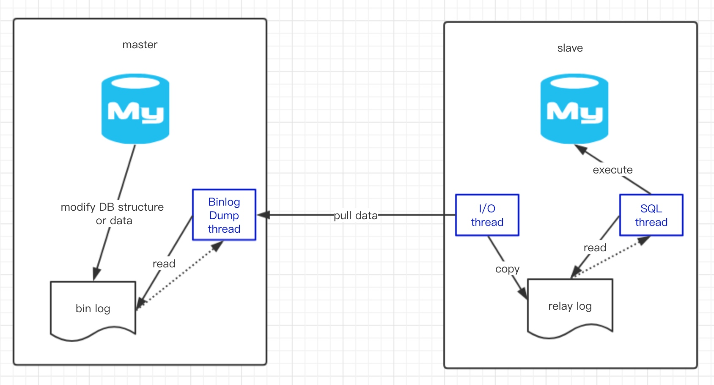

# ✅为什么MySQL默认使用RR隔离级别？

对于数据库的默认隔离级别，**Oracle默认的隔离级别是 RC，而MySQL默认的隔离级别是 RR。**


那么，你知道为什么Oracle选择RC作为默认级别，而MySQL要选择RR作为默认的隔离级别吗？


### Oracle 的隔离级别


Oracle只支持ANSI/ISO SQL定义的Serializable和Read Committed，其实，根据Oracle官方文档给出的介绍，Oracle支持三种隔离级别：


即Oracle支持Read Committed、Serializable和Read-Only。


Read-Only只读隔离级别类似于Serializable隔离级别，但是只读事务不允许在事务中修改数据，除非用户是SYS。


在Oracle这三种隔离级别中，Serializable和Read-Only显然都是不适合作为默认隔离级别的，那么就只剩Read Committed这个唯一的选择了。


### MySQL 的隔离级别


相比于Oracle，MySQL的默认隔离级别的可选范围就比较大了。


首先，我们先从四种隔离级别中排除Serializable和Read Uncommitted这两种，主要是因为这两个级别一个隔离级别太高，一个太低。太高的就会影响并发度，太低的就有脏读现象。


那么，剩下的RR和RC两种，怎么选？


在MySQL设计之初，他的定位就是提供一个稳定的关系型数据库。而为了要解决MySQL单点故障带来的问题，MySQL采用主从复制的机制。


**所谓主从复制，其实就是通过搭建MySQL集群，整体对外提供服务，集群中的机器分为主服务器（Master）和从服务器（Slave），主服务器提供写服务，从服务器提供读服务。**


为了保证主从服务器之间的数据的一致性，就需要进行**数据同步**，大致的同步过程如下，这里就不详细介绍了





**MySQL在主从复制的过程中，数据的同步是通过bin log进行的**，简单理解就是主服务器把数据变更记录到bin log中，然后再把bin log同步传输给从服务器，从服务器接收到bin log之后，再把其中的数据恢复到自己的数据库存储中。


那么，binlog里面记录的是什么内容呢？格式是怎样的呢？


MySQL的bin log主要支持三种格式，分别是statement、row以及mixed。MySQL是在5.1.5版本开始支持row的、在5.1.8版本中开始支持mixed。


[✅MySQL的binlog有几种格式](https://www.yuque.com/hollis666/xkm7k3/pl5wcg4cmn8dgufn)


statement和row最大的区别，**当binlog的格式为statement时，binlog 里面记录的就是 SQL 语句的原文**（这句话很重要！！！后面会用的到）。


因为MySQL早期只有statement这种bin log格式，这时候，如果使用提交读(Read Committed)、未提交读(Read Uncommitted)这两种隔离级别会出现问题。


举个例子，有一个数据库表t1，表中有如下两条记录：


```plain
CREATE TABLE `t1` (
  `a` int(11) DEFAULT NULL,
  `b` int(11) DEFAULT NULL,
  KEY `b` (`b`)
) ENGINE=InnoDB DEFAULT CHARSET=latin1;

insert into t1 values(10,1);
```


接着开始执行两个事务的写操作：


| **Session 1** | **Session 2** |
| --- | --- |
| set session transaction isolation level read committed; |  |
| set autocommit = 0; | set session transaction isolation level read committed; |
|  | set autocommit = 0; |
| begin; | begin; |
| delete from t1 where b < 100; | |
| | insert into t1 values(10,99); |
| | commit; |
| commit; | |


以上两个事务执行之后，数据库里面的记录会只有一条记录（10,99），这个发生在主库的数据变更大家都能理解。


> 即使 Session 1 的删除操作在 Session 2 的插入操作之后提交，由于 READ COMMITTED 的隔离级别，Session 2 的插入操作不会看到 Session 1 的删除操作，所以最后数据库中仍然会留下 Session 2 插入的记录 (10,99)。
>


以上两个事务执行之后，会在bin log中记录两条记录，因为事务2先提交，所以`insert into t1 values(10,99);`会被优先记录，然后再记录`delete from t1 where b < 100;`（再次提醒：statement格式的bin log记录的是SQL语句的原文）


这样bin log同步到备库之后，SQL语句回放时，会先执行`insert into t1 values(10,99);`，再执行`delete from t1 where b < 100;`。


这时候，数据库中的数据就会变成 EMPTY SET，即没有任何数据。这就导致主库和备库的数据不一致了！！！


为了避免这样的问题发生。MySQL就把数据库的默认隔离级别设置成了Repetable Read，那么，Repetable Read的隔离级别下是如何解决这样问题的那？


那是因为Repetable Read这种隔离级别，会在更新数据的时候不仅对更新的行加行级锁，还会增加**GAP锁和临键锁**。上面的例子，在事务2执行的时候，因为事务1增加了**GAP锁和临键锁**，就会导致事务2执行被卡住，需要等事务1提交或者回滚后才能继续执行。


除了设置默认的隔离级别外，MySQL还禁止在使用statement格式的bin log的情况下，使用READ COMMITTED作为事务隔离级别。


一旦用户主动修改隔离级别，尝试更新时，会报错：


```plain
ERROR 1598 (HY000): Binary logging not possible. Message: Transaction level 'READ-COMMITTED' in InnoDB is not safe for binlog mode 'STATEMENT'
```


所以，现在我们知道了，为什么MySQL选择RR作为默认的数据库隔离级别了吧，其实就是为了兼容历史上的那种statement格式的bin log。


## 为什么很多大厂会把默认的RR改成RC


[✅为什么默认RR，大厂要改成RC？](https://www.yuque.com/hollis666/xkm7k3/moe9ws)


> 原文: <https://www.yuque.com/hollis666/xkm7k3/fx5luearutigdcep>