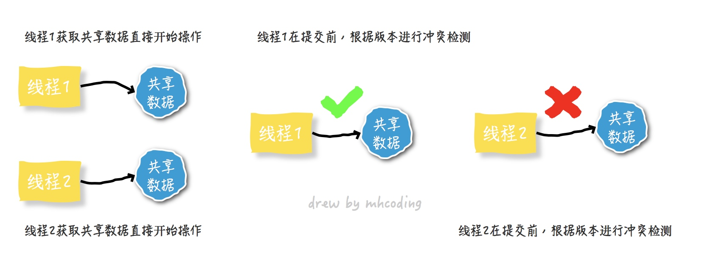

# ✅乐观锁与悲观锁如何实现？

# 典型回答


在MySQL中，悲观锁是需要依靠数据库提供的锁机制实现的，在InnoDB引擎中，要使用悲观锁，需要先关闭MySQL数据库的自动提交属性，然后通过`select ... for update`来进行加锁。


在数据库中，悲观锁的流程如下：


+ 在对记录进行修改前，先尝试为该记录加上排他锁（exclusive locking）。
+ 如果加锁失败，说明该记录正在被修改，那么当前查询可能要等待或者抛出异常。具体响应方式由开发者根据实际需要决定。
+ 如果成功加锁，那么就可以对记录做修改，事务完成后就会解锁了。
+ 其间如果有其他对该记录做修改或加排他锁的操作，都会等待我们解锁或直接抛出异常。


我们举一个简单的例子，如淘宝下单过程中扣减库存的需求说明一下如何使用悲观锁：


```plain
//0.开始事务
begin; 
//1.查询出商品信息
select quantity from items where id=1 for update;
//2.修改商品quantity为2
update items set quantity=2 where id = 1;
//3.提交事务
commit;
```


以上，在对id = 1的记录修改前，先通过for update的方式进行加锁，然后再进行修改。这就是比较典型的悲观锁策略。


如果以上修改库存的代码发生并发，同一时间只有一个线程可以开启事务并获得id=1的锁，其它的事务必须等本次事务提交之后才能执行。这样我们可以保证当前的数据不会被其它事务修改。


> 上面我们提到，使用select…for update会把数据给锁住，不过我们需要注意一些锁的级别，MySQL InnoDB默认行级锁。行级锁都是基于索引的，如果一条SQL语句用不到索引的话，优化器在选择时候，如果发现锁表可能性能更好的话，有可能会直接锁表。
>


MySQL中的乐观锁主要通过CAS的机制来实现，一般通过version版本号来实现。


CAS是项乐观锁技术，当多个线程尝试使用CAS同时更新同一个变量时，只有其中一个线程能更新变量的值，而其它线程都失败，失败的线程并不会被挂起，而是被告知这次竞争中失败，并可以再次尝试。


比如前面的扣减库存问题，通过乐观锁可以实现如下：


```plain
//查询出商品信息，quantity = 3
select quantity from items where id=1
//根据商品信息生成订单
//修改商品quantity为2
update items set quantity=2 where id=1 and quantity = 3;
```


以上，我们在更新之前，先查询一下库存表中当前库存数（quantity），然后在做update的时候，以库存数作为一个修改条件。当我们提交更新的时候，判断数据库表对应记录的当前库存数与第一次取出来的库存数进行比对，如果数据库表当前库存数与第一次取出来的库存数相等，则予以更新，否则认为是过期数据。


# 扩展知识


## 悲观锁


<font style="color:rgb(85, 85, 85);">当我们要对一个数据库中的一条数据进行修改的时候，为了避免同时被其他人修改，最好的办法就是直接对该数据进行加锁以防止并发。</font>

<font style="color:rgb(85, 85, 85);"></font>

<font style="color:rgb(85, 85, 85);">这种借助数据库锁机制在修改数据之前先锁定，再修改的方式被称之为悲观并发控制（又名“悲观锁”，Pessimistic Concurrency Control，缩写“PCC”）。</font>

<font style="color:rgb(85, 85, 85);"></font>

<font style="color:rgb(85, 85, 85);">之所以叫做悲观锁，是因为这是一种对数据的修改抱有悲观态度的并发控制方式。我们一般认为数据被并发修改的概率比较大，所以需要在修改之前先加锁。</font>

<font style="color:rgb(85, 85, 85);"></font>

<font style="color:rgb(85, 85, 85);">悲观并发控制实际上是“先取锁再访问”的保守策略，为数据处理的安全提供了保证。</font>

<font style="color:rgb(85, 85, 85);"></font>


<font style="color:rgb(85, 85, 85);"></font>

<font style="color:rgb(85, 85, 85);">但是在效率方面，处理加锁的机制会让数据库产生额外的开销，还有增加产生死锁的机会；另外，还会降低并行性，一个事务如果锁定了某行数据，其他事务就必须等待该事务处理完才可以处理那行数据。</font>

<font style="color:rgb(85, 85, 85);"></font>

## <font style="color:rgb(85, 85, 85);">乐观锁</font>
<font style="color:rgb(85, 85, 85);">乐观锁（ Optimistic Locking ） 是相对悲观锁而言的，乐观锁假设数据一般情况下不会造成冲突，所以在数据进行提交更新的时候，才会正式对数据的冲突与否进行检测，如果发现冲突了，则让返回用户错误的信息，让用户决定如何去做。</font>

<font style="color:rgb(85, 85, 85);"></font>

<font style="color:rgb(85, 85, 85);">相对于悲观锁，在对数据库进行处理的时候，乐观锁并不会直接使用数据库提供的锁机制。一般的实现乐观锁的方式就是记录数据版本。</font>

<font style="color:rgb(85, 85, 85);"></font>

<font style="color:rgb(85, 85, 85);">注意：不直接使用不代表就没有锁！</font>

[✅数据库乐观锁的过程中，完全没有加任何锁吗？](https://www.yuque.com/hollis666/xkm7k3/vk7tpwcpzfh35d04)

<font style="color:rgb(85, 85, 85);"></font>

<font style="color:rgb(85, 85, 85);"></font>

<font style="color:rgb(85, 85, 85);">乐观并发控制相信事务之间的数据竞争(data race)的概率是比较小的，因此尽可能直接做下去，直到提交的时候才去锁定，所以不会产生任何锁和死锁。</font>

<font style="color:rgb(85, 85, 85);"></font>

## <font style="color:rgb(85, 85, 85);">如何选择</font>
<font style="color:rgb(85, 85, 85);">在乐观锁与悲观锁的选择上面，主要看下两者的区别以及适用场景就可以了。</font>

<font style="color:rgb(85, 85, 85);"></font>

<font style="color:rgb(85, 85, 85);">1、乐观锁并未真正加锁，效率高。</font>**适用于读操作频繁，写操作相对较少的场景。**<font style="color:rgb(85, 85, 85);">一旦锁的粒度掌握不好，更新失败的概率就会比较高，容易发生业务失败。 </font>

<font style="color:rgb(85, 85, 85);">2、悲观锁依赖数据库锁，效率低。更新失败的概率比较低。</font>**适用于写操作较为频繁，且并发写入的概率较高的场景。**

<font style="color:rgb(85, 85, 85);"></font>

[✅高并发场景中，乐观锁和悲观锁哪个更适合？](https://www.yuque.com/hollis666/xkm7k3/kzkm89bnr0fzdeyi)


> 原文: <https://www.yuque.com/hollis666/xkm7k3/ionc18>