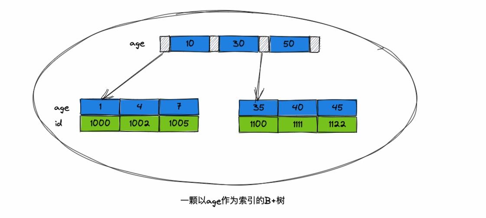
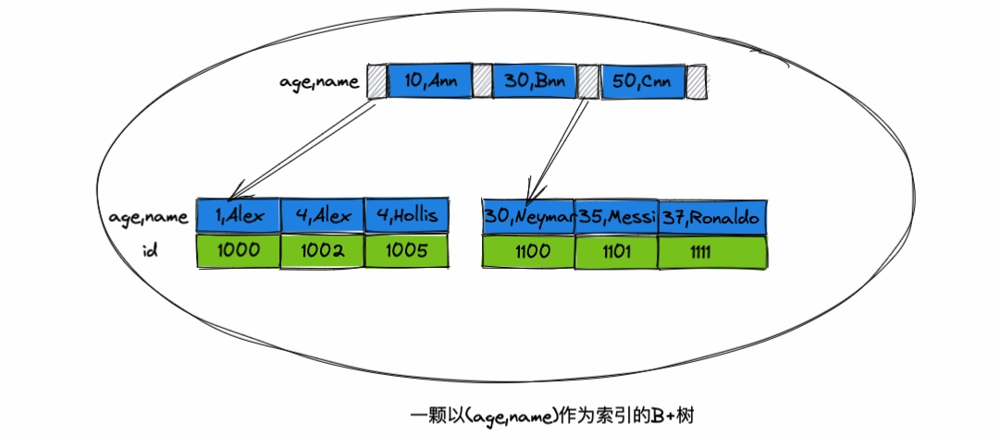

# ✅什么是最左前缀匹配？为什么要遵守？

# 典型回答

在MySQL中，最左前缀匹配是指在查询中利用索引的最左边的一部分来进行匹配。指你执行查询时，如果查询条件涉及到了组合索引的前几个列，MySQL 就可以利用这个复合索引来进行匹配。

> 组合索引，指的就是有多个字段组成的一个联合索引，如 idx_col1_col2_col3 (col1,col2,col3))
>

假如我们创建了一个组合索引 (col1, col2, col3)，如果你的查询条件是针对 col1 、 (col1, col2)或者(col1, col2, col3)，那么MySQL可以利用这个复合索引进行最左前缀匹配。

> 而且如果你用的是 (col1, col3)也是可以走索引的，只不过他用到的是 col1这个字段的索引。
>

但是，如果查询条件涉及到的列只有 col2 或者 只有col3或者只有col2和col3，总之就是如果不包含col1的话，那么是没有遵守最左前缀匹配，那么通常情况下（不考虑索引跳跃扫描等其他优化），就不能利用这个索引进行最左前缀匹配。

并且，需要注意的是，最左前缀匹配和查询条件的顺序没有关系，不管你写的是`where col1 = "Holiis" and col2 = "666" `还是 `where col2 = "666" and col1 = "Holiis" ` 对结果都没有影响，该命中还是会命中。

但是，需要大家注意的是，很多人会以为创建一个组合索引 (col1, col2, col3)的时候，数据库会创建出三个索引 (col1)、 (col1, col2)和(col1, col2, col3)，这么理解其实是不对的，他创建的只是一棵B+树，只不过在这颗树中，他是先按照col1排序，在col1相同时再按照col2排序的，col2相同再按照col3排序。

另外，如果不涉及到联合索引，单个字段的索引也需要遵守最左前缀，即有一个字段值为"abc"时，当我们使用like进行模糊匹配时，`like "ab%"`是可以走索引的，而`"%bc"、"b%c"`都是不行的，就是因为后者不遵守最左前缀匹配的原则了。

# 扩展知识
## 为什么要遵循最左前缀匹配
我们都知道，MySQL的Innodb引擎中，索引是通过B+树来实现的。不管是普通索引还是联合索引，都需要构造一个B+树的索引结构。

那么，我们都知道普通索引的存储结构是在B+树的每个非叶子节点上记录索引的值，而这棵B+树的叶子节点上记录的是索引的值和聚簇索引（主键索引）的值的。

如：

（这样图是简化的，实际上还有双向链表，具体的可以参考索引介绍的文章）

那么，如果是联合索引的话，这棵B+树又是如何存储的呢？

在联合索引中，联合索引(age,name)也是一个B+树，非叶子节点中记录的是name,age两个字段的值，叶子节点中记录的是name，age两个字段以及主键id的值。

在存储的过程中，如上图所示，当age不同时，按照age排序，当age相同时，则按照name排序。

所以，了解了索引的存储结构之后，我们就很容易理解最左前缀匹配了：**因为索引底层是一个B+树，如果是联合索引的话，在构造B+树的时候，会先按照左边的key进行排序，左边的key相同时再依次按照右边的key排序。**

所以，**在通过索引查询的时候，也需要遵守最左前缀匹配的原则，也就是需要从联合索引的最左边开始进行匹配，这时候就要求查询语句的where条件中，包含最左边的索引的值。**

## 

> 原文: <https://www.yuque.com/hollis666/xkm7k3/cc9mglopp4nigg59>