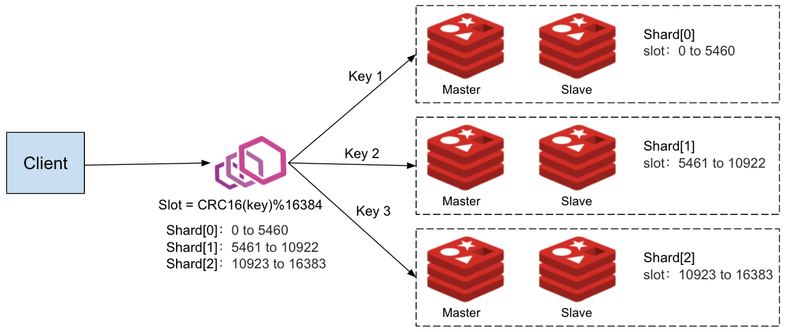

# ✅什么是Redis的数据分片？

# 典型回答

Redis的数据分片（sharding）是一种将一个Redis数据集分割成多个部分，分别存储在不同的Redis节点上的技术。它可以用于将一个单独的Redis数据库扩展到多个物理机器上，从而提高Redis集群的性能和可扩展性。

Redis数据分片的实现方式通常是将数据按照某种规则（例如，key的hash值）分配到不同的节点上。当客户端想要访问某个key时，它会先计算出这个key应该存储在哪个节点上，然后直接连接到该节点进行操作。因此，对于客户端而言，Redis集群就像是一个大型的、统一的数据库，而不需要关心数据的实际分布情况。

**在Redis的Cluster 集群模式中，使用哈希槽（hash slot）的方式来进行数据分片**，将整个数据集划分为多个槽，每个槽分配给一个节点。客户端访问数据时，先计算出数据对应的槽，然后直接连接到该槽所在的节点进行操作。Redis Cluster还提供了自动故障转移、数据迁移和扩缩容等功能，能够比较方便地管理一个大规模的Redis集群。

Redis Cluster将整个数据集划分为**16384个槽**，每个槽都有一个编号（0~16383），集群的每个节点可以负责多个hash槽，客户端访问数据时，先根据key计算出对应的槽编号，然后根据槽编号找到负责该槽的节点，向该节点发送请求。

在 Redis 的每一个节点上，都有这么两个东西，一个是槽（slot），它的的取值范围是：0-16383。还有一个就是 cluster，可以理解为是一个集群管理的插件。当我们的存取的 Key 的时候，Redis 会根据 **CRC16 算法**得出一个结果，然后把结果对 16384 求余数，这样每个 key 都会对应一个编号在 0-16383 之间的哈希槽，通过这个值，去找到对应的插槽所对应的节点，然后直接自动跳转到这个对应的节点上进行存取操作。

Redis Cluster中的数据分片具有以下特点：

1. **提升性能和吞吐量**：通过在多个节点上分散数据，可以并行处理更多的操作，从而提升整体的性能和吞吐量。这在高流量场景下尤其重要，因为单个节点可能无法处理所有请求。
2. **提高可扩展性**：分片使得Redis可以水平扩展。可以通过添加更多节点扩展数据库的容量和处理能力。
3. **更好的资源利用**：分片允许更有效地利用服务器资源。每个节点只处理数据的一部分，这降低了单个节点的内存和计算需求。
4. **避免单点故障**：在没有分片的情况下，如果唯一的Redis服务器发生故障，整个服务可能会停止。在分片的环境中，即使一个节点出现问题，其他节点仍然可以继续运行。
5. **数据冗余和高可用性**：在某些分片策略中，如Redis集群，每个分片的数据都可以在集群内的其他节点上进行复制。这意味着即使一个节点失败，数据也不会丢失，从而提高了系统的可用性。

# 扩展知识

## 16384

**Redis Cluster将整个数据集划分为16384个槽，为什么是16384呢，这个数字有什么特别的呢？**

这个问题在Github上有所讨论，Redis的作者也下场做过回复：[https://github.com/redis/redis/issues/2576](https://github.com/redis/redis/issues/2576)

> The reason is:
>
> 
>
> 1、Normal heartbeat packets carry the full configuration of a node, that can be replaced in an idempotent way with the old in order to update an old config. This means they contain the slots configuration for a node, in raw form, that uses 2k of space with16k slots, but would use a prohibitive 8k of space using 65k slots.
>
> 
>
> 2、At the same time it is unlikely that Redis Cluster would scale to more than 1000 mater nodes because of other design tradeoffs.
>
> 
>
> So 16k was in the right range to ensure enough slots per master with a max of 1000 maters, but a small enough number to propagate the slot configuration as a raw bitmap easily. Note that in small clusters the bitmap would be hard to compress because when N is small the bitmap would have slots/N bits set that is a large percentage of bits set.
>

16384这个数字是一个2的14次方（2^14），尽管crc16能得到2^16 -1=65535个值，但是并没有选择，主要从消息大小和集群规模等方面考虑的：

1、正常的心跳数据包携带了节点的完整配置，在更新配置的时候，可以以幂等方式进行替换。这意味着它们包含了节点的原始槽配置，对于包含16384个槽位的情况，使用2k的空间就够了，但如果使用65535个槽位，则需要使用8k的空间，这就有点浪费了。

2、由于其他设计权衡的原因，Redis Cluster不太可能扩展到超过1000个主节点，这种情况下，用65535的话会让每个节点上面的slot太多了，会导致节点的负载重并且数据迁移成本也比较高。而16384是相对比较好的选择，可以在1000个节点下使得slot均匀分布，每个分片平均分到的slot不至于太小。

除此之外，还有一些原因和优点供大家参考：

1. 易于扩展：槽数量是一个固定的常数，这样就可以方便地进行集群的扩展和缩小。如果需要添加或删除节点，只需要将槽重新分配即可。
2. 易于计算：哈希算法通常是基于槽编号计算的，**将槽数量设置为2的幂次方，可以使用位运算等简单的算法来计算槽编号，从而提高计算效率。**
3. 负载均衡：槽数量的选择可以影响数据的负载均衡。如果槽数量太少，会导致某些节点负载过重；如果槽数量太多，会导致数据迁移的开销过大。**16384这个数量在实践中被证明是一个比较合适的选择，能够在保证负载均衡的同时，减少数据迁移的开销。**

## CRC16算法
<u>（简单了解即可，面试一般不做要求）</u>

当我们的存取的 Key 的时候，Redis 会根据 **CRC16 算法**得出一个结果，然后把结果对 16384 求余数，这样每个 key 都会对应一个编号在 0-16383 之间的哈希槽。

那么，什么是CRC16算法呢？

CRC16（Cyclic Redundancy Check，循环冗余校验码）算法是一种广泛使用的校验算法，主要用于数据通信和数据存储等领域，例如网络通信中的错误检测和校正、数据存储中的文件校验和等。

CRC16算法基于多项式除法，将输入数据按位进行多项式除法运算，最后得到一个16位的校验码。CRC16算法的计算过程包括以下几个步骤：

1. 初始化一个16位的寄存器为全1；
2. 将输入数据的第一个字节与16位寄存器的低8位进行异或操作，结果作为新的16位寄存器的值；
3. 将16位寄存器的高8位和低8位分别右移一位，丢弃掉最低位，即寄存器右移一位；
4. 如果输入数据还没有处理完，转到第2步继续处理下一个字节；
5. 如果输入数据已经处理完，将16位寄存器的值取反，得到CRC16校验码。

CRC16算法的多项式是一个固定的16位二进制数，不同的CRC16算法使用的多项式也不相同。例如，CRC-16/CCITT算法使用的多项式为0x1021，而Modbus CRC16算法使用的多项式为0xA001。

CRC16算法的优点是计算速度快，校验效果好，具有广泛的应用范围。缺点是只能检测错误，无法纠正错误。如果数据被修改，CRC校验值也会被修改，但无法确定是哪一位数据被修改。因此，在数据传输和存储中，通常需要与其它校验算法配合使用，以保证数据的完整性和正确性。

> 原文: <https://www.yuque.com/hollis666/xkm7k3/fm1elfrg5mn9iw65>