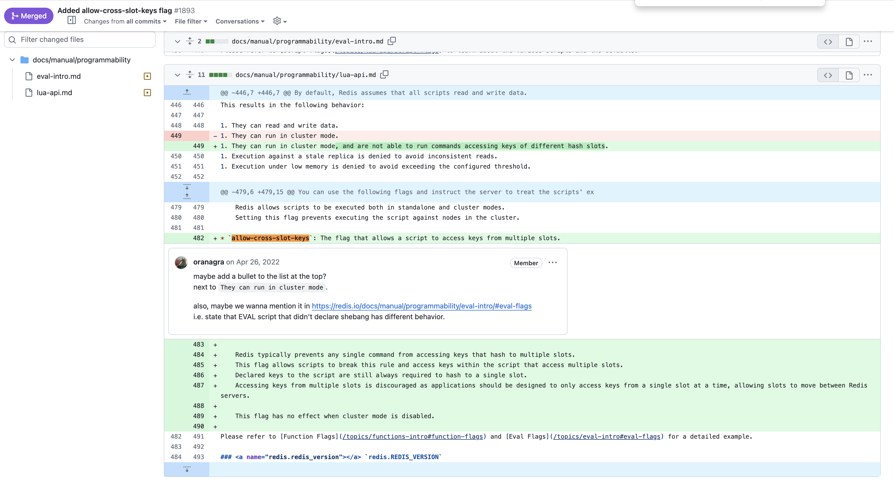

# ✅如何在 Redis Cluster 中执行 lua 脚本？

# 典型回答
[✅Redis Cluster 中使用事务和 lua 有什么限制？](https://www.yuque.com/hollis666/xkm7k3/zb66y7he56otikqs)

因为 Redis  Cluster 中，数据会被分片到多个节点上，跨节点的 lua 脚本是不支持的，所以就会失败。但是 Cluster 是很常见的场景，lua （以及事务）也是一个非常重要的用法，这个问题怎么解决呢？

### Hash Tag

在 Redis 的官方中，提到了一个 hash tags的功能：

如果我们想要执行 lua 脚本或者事务的时候，就需要确保多个相关的键应该存储在同一个节点上以便执行原子操作，**默认情况下，Redis 使用键的哈希值来决定将数据存储在哪个节点。**而Redis 中的 hashtag 就是一种可以让我们干预 hash 结果的机制。

Redis 中的 hashtag 是键名中用大括号 {} 包裹的部分。Redis 对大括号内的字符串计算哈希值，并基于这个哈希值将键分配到特定的节点。只有键名中包含大括号，且大括号内有内容时，大括号内的部分才会被用来计算哈希值。如果大括号为空或不包含任何字符，Redis 将整个键名用于哈希计算。

有了这个特性，我们就可以在设计键名时，可以将共享相同逻辑或数据集的键包含相同的 hashtag。就和我们在 MySQL 的分库分表中的基因法其实是类似的概念。

例如，如果你有多个与用户 ID 相关的键，可以使用 user:{12345}:profile 和 user:{12345}:settings 这样的命名方式，确保它们都位于同一个节点。这样他只会用{12345}进行 hash 算法，这样虽然他们是不同的key，但是分片之后的结果就可以在同一个节点上。这样就能执行事务或者 lua 脚本了。

### 其他方案

除了使用 Hash Tag 以外，还有一些其他的方案，也能实现，比如：

1. 应用层处理：如果跨节点操作不可避免，可以在应用层通过分布式事务管理器或其他机制来协调多个节点的数据一致性。这通常需要复杂的逻辑和额外的开发工作。

2. 拆分操作：尽量将需要事务处理的逻辑拆分成多个独立的、可以在单个节点上执行的小操作，从而避免跨节点事务的需求。

# 扩展知识

## **allow-cross-slot-keys**

在 Redis 7.0.11中新增了一个命令：**allow-cross-slot-keys**

****

[https://github.com/redis/redis-doc/pull/1893/files](https://github.com/redis/redis-doc/pull/1893/files)

开启这个配置，可以允许在单个命令中使用不同槽（slot）的键。例如，你可以在一个 MSET 命令中设置多个键，即使这些键属于不同的槽。

但是，需要注意的是，即使启用了 allow-cross-slot-keys，事务中的所有键仍然必须位于同一个槽（即同一个节点）才能保证事务的原子性。如果事务中的键分布在不同的节点上，Redis 会拒绝执行这些命令。

所以，网上有的文章说，使用 allow-cross-slot-keys就能做跨节点事务或者 lua 了，其实是不对的！

但是需要注意的是，启用这个选项的命令可能会因为涉及多个节点的网络通信而导致性能降低，但这并不会让这些操作变成原子操作。

> 原文: <https://www.yuque.com/hollis666/xkm7k3/hrbvqgdg21k8znhw>