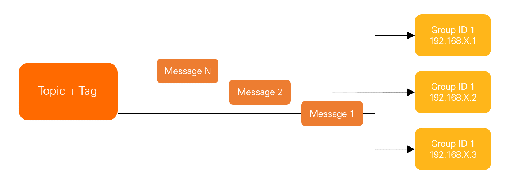

# ✅RocketMQ怎么实现消息分发的？

# 典型回答


RocketMQ 支持两种消息模式：**广播消费（ Broadcasting ）**和**集群消费（ Clustering ）**。


**广播消费**：当使用广播消费模式时，RocketMQ 会将每条消息推送给集群内所有的消费者，保证消息至少被每个消费者消费一次。


广播模式下，RocketMQ 保证消息至少被客户端消费一次，但是并不会重投消费失败的消息，因此业务方需要关注消费失败的情况。并且，客户端每一次重启都会从最新消息消费。客户端在被停止期间发送至服务端的消息将会被自动跳过。


**集群消费**：当使用集群消费模式时，RocketMQ 认为任意一条消息只需要被集群内的任意一个消费者处理即可。





集群模式下，每一条消息都只会被分发到一台机器上处理。但是不保证每一次失败重投的消息路由到同一台机器上。一般来说，用集群消费的更多一些。


通过设置MessageModel可以调整消费方式：


```plain
// MessageModel设置为CLUSTERING（不设置的情况下，默认为集群订阅方式）。
properties.put(PropertyKeyConst.MessageModel, PropertyValueConst.CLUSTERING);


// MessageModel设置为BROADCASTING。
properties.put(PropertyKeyConst.MessageModel, PropertyValueConst.BROADCASTING); 
```


> 原文: <https://www.yuque.com/hollis666/xkm7k3/qxu868f094az60aa>