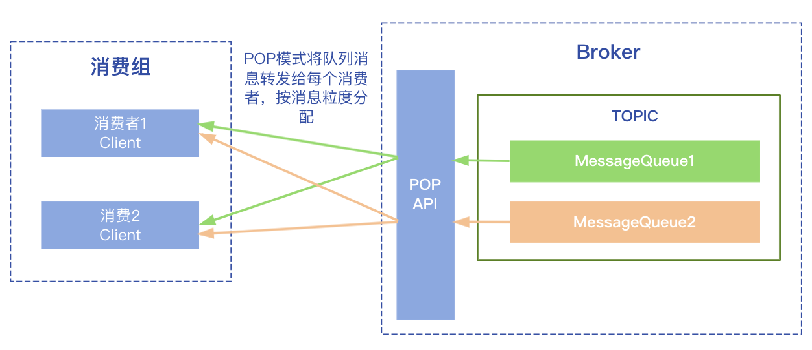

# ✅介绍下 RocketMQ 5.0中的 pop 模式

# 典型回答

在5.0之前，RocketMQ 的消息投递方式有推和拉两种

[✅RocketMQ的消息是推还是拉？](https://www.yuque.com/hollis666/xkm7k3/bzhy0q)

RocketMQ 5.0 引入的一种新的消费模式——Pop 模式，它结合了 Pull 和 Push 模式的优点，提供了一种高效、低延迟的消息消费方式。

Pop 模式其实也是一种拉的模式，主要是来代替原来的 push 模式的。

在5.0以前的 push 模式中（其实也是基于拉实现的）。客户端在开始消费消息前，会需要通过负载均衡算法计算出自己需要消费哪些 Queue，每当 Consumer 数量发生变化时就会触发ReBalance。

这个负载均衡是在客户端做的，也就是消费者这里，这也就意味着如果负载均衡时间过长会影响消费者的消费。

但是，这种模式有个问题，那就是无法通过一直增加客户端数量的方式来提升消费呢能力。因为 Queue 数量有限，客户端数量一旦达到 Queue 数量，再扩容的话，也会因为无法分配到 Queue而无法消费。这也就是传统的 push 模式的性能瓶颈。

除了负载均衡以外，push 模式中，消费者除了要做负载均衡以外，还有很多其他的申请要求，比如消息拉取，消息消费位点管理等等。这使得客户端的职责很大，出错的概率也比较大。

还有一个问题，那就是如果某个消费者hang主，会导致分配到该消费者的消息队列中的消息无法消费，导致消息积压；

于是在5.0中推出了一个新的 POP模式，来解决这些问题。

在 POP 模式中，消费者不需要感知到分区，即MessageQueue 和消费者不在进行绑定了，并且POP的消费位点也由Broker保存和控制。消费者直接通过 POP 模型提供的接口去获取到数据，消费成功后 ACK 数据。

这样做好处就是消费者只需要负责POP 消息，不再需要进行负载均衡以及消息的进度管理。并且即便某个消费者hang住，其他消费者依旧可以继续消费队列中的数据，不会造成消息堆积。

> 原文: <https://www.yuque.com/hollis666/xkm7k3/mfut53gopeups27r>