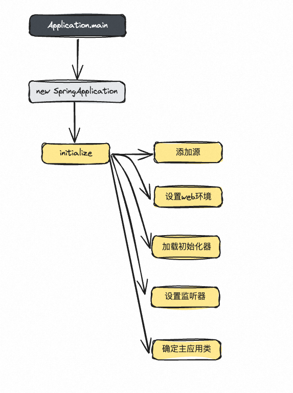
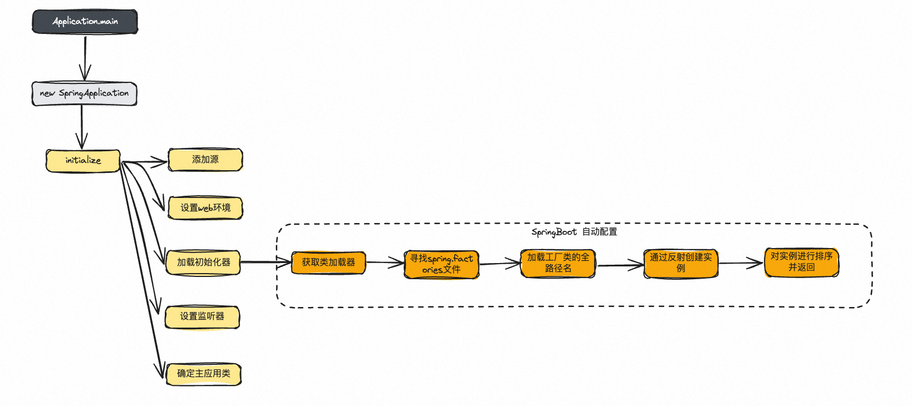
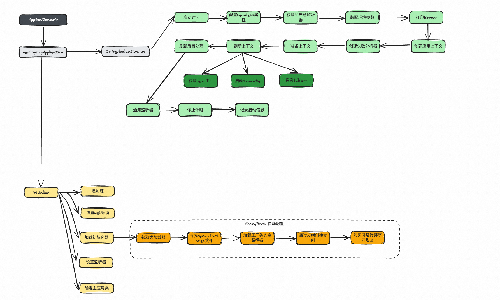

# ✅SpringBoot的启动流程是怎么样的？

# 典型回答


以下就是一个SpringBoot启动的入口，想要了解SpringBoot的启动过程，就从这里开始。


```java
@SpringBootApplication
public class Application {
    public static void main(String[] args) {
    	SpringApplication.run(Application.class, args);  也可简化调用静态方法
    }
}
```


这里我们直接看重重点的`SpringApplication.run(Application.class, args);`方法。他的实现细节如下：


```java
public static ConfigurableApplicationContext run(Object source, String... args) {
    return run(new Object[] { source }, args);
}

public static ConfigurableApplicationContext run(Object[] sources, String[] args) {
    return new SpringApplication(sources).run(args);
}
```


最终就是`new SpringApplication(sources).run(args)`这部分代码了。那么接下来就需要分两方面介绍SpringBoot的启动过程。一个是`new SpringApplication`的初始化过程，一个是`SpringApplication.run`的启动过程。


### new SpringApplication()


在SpringApplication的构造函数中，调用了一个initialize方法，所以他的初始化逻辑直接看这个initialize方法就行了。流程图及代码如下：




```java
public SpringApplication(Object... sources) {
    initialize(sources);
}

private void initialize(Object[] sources) {
    // 添加源：如果 sources 不为空且长度大于 0，则将它们添加到应用的源列表中
    if (sources != null && sources.length > 0) {
        this.sources.addAll(Arrays.asList(sources));
    }

    // 设置web环境：推断并设置 Web 环境（例如，检查应用是否应该运行在 Web 环境中）
    this.webEnvironment = deduceWebEnvironment();

    // 加载初始化器：设置 ApplicationContext 的初始化器，从 'spring.factories' 文件中加载 ApplicationContextInitializer 实现
    setInitializers((Collection) getSpringFactoriesInstances(ApplicationContextInitializer.class));

    // 设置监听器：从 'spring.factories' 文件中加载 ApplicationListener 实现
    setListeners((Collection) getSpringFactoriesInstances(ApplicationListener.class));

    // 确定主应用类：通常是包含 main 方法的类
    this.mainApplicationClass = deduceMainApplicationClass();
}

```


1. **添加源**：将提供的源（通常是配置类）添加到应用的源列表中。
2. **设置 Web 环境**：判断应用是否应该运行在 Web 环境中，这会影响后续的 Web 相关配置。
3. **加载初始化器**：从 `spring.factories` 文件中加载所有列出的 `ApplicationContextInitializer` 实现，并将它们设置到 `SpringApplication` 实例中，以便在应用上下文的初始化阶段执行它们。
4. **设置监听器**：加载和设置 `ApplicationListener`  实例，以便应用能够响应不同的事件。
5. **确定主应用类**：确定主应用类，这个主应用程序类通常是包含 `public static void main(String[] args)` 方法的类，是启动整个 `Spring Boot `应用的入口点。


**这里面第三步，加载初始化器这一步是Spring Boot的自动配置的核心**，因为在这一步会从 spring.factories 文件中加载并实例化指定类型的类。


具体实现的代码和流程如下：


```java
private <T> Collection<? extends T> getSpringFactoriesInstances(Class<T> type, Class<?>[] parameterTypes, Object... args) {
    // 获取当前线程的上下文类加载器
    ClassLoader classLoader = Thread.currentThread().getContextClassLoader();

    // 从spring.factories加载指定类型的工厂名称，并使用LinkedHashSet确保名称的唯一性，以防重复
    Set<String> names = new LinkedHashSet<String>(SpringFactoriesLoader.loadFactoryNames(type, classLoader));

    // 创建指定类型的实例。这里使用反射来实例化类，并传入任何必要的参数
    List<T> instances = createSpringFactoriesInstances(type, parameterTypes, classLoader, args, names);

    // 对实例进行排序，这里使用的是Spring的注解感知比较器，可以处理@Order注解和Ordered接口
    AnnotationAwareOrderComparator.sort(instances);

    // 返回实例集合
    return instances;
}
```


以下就是new SpringApplication的主要流程，主要依赖initialize 方法初始化 Spring Boot 应用的关键组件和配置。





这个过程确保了在应用上下文被创建和启动之前，所有关键的设置都已就绪，包括环境设置、初始化器和监听器的配置，以及主应用类的识别。


### SpringApplication.run


看完了new SpringApplication接下来就在看看run方法做了哪些事情。这个方法是 SpringApplication 类的核心，用于启动 Spring Boot 应用。


```java
public ConfigurableApplicationContext run(String... args) {
    // 创建并启动一个计时器，用于记录应用启动耗时
    StopWatch stopWatch = new StopWatch();
    stopWatch.start();

    ConfigurableApplicationContext context = null;
    FailureAnalyzers analyzers = null;

    // 配置无头（headless）属性，影响图形环境的处理
    configureHeadlessProperty();

    // 获取应用运行监听器，并触发开始事件
    SpringApplicationRunListeners listeners = getRunListeners(args);
    listeners.starting();

    try {
        // 创建应用参数对象
        ApplicationArguments applicationArguments = new DefaultApplicationArguments(args);
        // 准备环境，包括配置文件和属性源
        ConfigurableEnvironment environment = prepareEnvironment(listeners, applicationArguments);
        // 打印应用的 Banner
        Banner printedBanner = printBanner(environment);
        // 创建应用上下文
        context = createApplicationContext();
        // 创建失败分析器
        analyzers = new FailureAnalyzers(context);
        // 准备上下文，包括加载 bean 定义
        prepareContext(context, environment, listeners, applicationArguments, printedBanner);
        // 刷新上下文，完成 bean 的创建和初始化
        refreshContext(context);
        // 刷新后的后置处理
        afterRefresh(context, applicationArguments);
        // 通知监听器，应用运行完成
        listeners.finished(context, null);
        // 停止计时器
        stopWatch.stop();
        // 如果启用了启动信息日志，记录应用的启动信息
        if (this.logStartupInfo) {
            new StartupInfoLogger(this.mainApplicationClass).logStarted(getApplicationLog(), stopWatch);
        }
        //触发ApplicationStartedEvent 事件
        listeners.started(context);
        //调用实现了 CommandLineRunner 和 ApplicationRunner 接口的 bean 中的 run 方法
		callRunners(context, applicationArguments);
        // 触发 ApplicationReadyEvent 事件
        listeners.running(context);
        // 返回配置好的应用上下文
        return context;
    }
    catch (Throwable ex) {
        // 处理运行失败的情况
        handleRunFailure(context, listeners, analyzers, ex);
        throw new IllegalStateException(ex);
    }
}

```


以上的过程太复杂了，我们挑几个关键的介绍一下他们的主要作用。


**启动&停止计时器**：在代码中，用到stopWatch来进行计时。所以在最开始先要启动计时，在最后要停止计时。这个计时就是最终用来统计启动过程的时长的。最终在应用启动信息输出的实时打印出来，如以下内容：


```java
2023-11-18 09:00:05.789  INFO 12345 --- [           main] com.hollis.myapp.Application            : Started Application in 6.666 seconds (JVM running for 7.789)
```


**获取和启动监听器：**这一步从spring.factories中解析初始所有的SpringApplicationRunListener 实例，并通知他们应用的启动过程已经开始。


> SpringApplicationRunListener 是 Spring Boot 中的一个接口，用于在应用的启动过程中的不同阶段提供回调。实现这个接口允许监听并响应应用启动周期中的关键事件。SpringApplicationRunListener 接口定义了多个方法，每个方法对应于启动过程中的一个特定阶段。这些方法包括：
>
> 1. starting()：在运行开始时调用，此时任何处理都未开始，可以用于初始化在启动过程中需要的资源。
> 2. environmentPrepared()：当 SpringApplication 准备好 Environment（但在创建 ApplicationContext 之前）时调用，这是修改应用环境属性的好时机。
> 3. contextPrepared()：当 ApplicationContext 准备好但在它加载之前调用，可以用于对上下文进行一些预处理。
> 4. contextLoaded()：当 ApplicationContext 被加载（但在它被刷新之前）时调用，这个阶段所有的 bean 定义都已经加载但还未实例化。
> 5. started()：在 ApplicationContext 刷新之后、任何应用和命令行运行器被调用之前调用，此时应用已经准备好接收请求。
> 6. running()：在运行器被调用之后、应用启动完成之前调用，这是在应用启动并准备好服务请求时执行某些动作的好时机。
> 7. failed()：如果启动过程中出现异常，则调用此方法。
>


**装配环境参数：**这一步主要是用来做参数绑定的，prepareEnvironment 方法会加载应用的外部配置。这包括 application.properties 或 application.yml 文件中的属性，环境变量，系统属性等。所以，我们自定义的那些参数就是在这一步被绑定的。


**打印Banner：**这一步的作用很简单，就是在控制台打印应用的启动横幅Banner。如以下内容：


```java
  .   ____          _            __ _ _
 /\\ / ___'_ __ _ _(_)_ __  __ _ \ \ \ \
( ( )\___ | '_ | '_| | '_ \/ _` | \ \ \ \
 \\/  ___)| |_)| | | | | || (_| |  ) ) ) )
  '  |____| .__|_| |_|_| |_\__, | / / / /
 =========|_|==============|___/=/_/_/_/
 :: Spring Boot ::                (v3.1.5)
```


**创建应用上下文：**到这一步就真的开始启动了，第一步就是先要创建一个Spring的上下文出来，只有有了这个上下文才能进行Bean的加载、配置等工作。


**准备上下文**：这一步非常关键，很多核心操作都是在这一步完成的：


```java
private void prepareContext(ConfigurableApplicationContext context, ConfigurableEnvironment environment,
        SpringApplicationRunListeners listeners, ApplicationArguments applicationArguments, Banner printedBanner) {

    // 将environment设置到应用上下文中
    context.setEnvironment(environment);

    // 对应用上下文进行后处理（可能涉及一些自定义逻辑）
    postProcessApplicationContext(context);

    // 应用所有的ApplicationContextInitializer
    applyInitializers(context);

    // 通知监听器上下文准备工作已完成
    listeners.contextPrepared(context);

    // 如果启用了启动信息日志，则记录启动信息和配置文件信息
    if (this.logStartupInfo) {
        logStartupInfo(context.getParent() == null);
        logStartupProfileInfo(context);
    }

    // 向上下文中添加特定于 Spring Boot 的单例 Bean
    context.getBeanFactory().registerSingleton("springApplicationArguments", applicationArguments);
    if (printedBanner != null) {
        context.getBeanFactory().registerSingleton("springBootBanner", printedBanner);
    }

    // 加载应用的源（如配置类）
    Set<Object> sources = getSources();
    Assert.notEmpty(sources, "Sources must not be empty");
    load(context, sources.toArray(new Object[sources.size()]));

    // 通知监听器上下文加载已完成
    listeners.contextLoaded(context);
}

```


在这一步，会打印启动的信息日志，主要内容如下：

```java
2023-11-18 09:00:00.123  INFO 12345 --- [           main] com.example.myapp.Application            : Starting Application v0.1.0 on MyComputer with PID 12345 (started by user in /path/to/app)
```


**刷新上下文**：这一步，是Spring启动的核心步骤了，这一步骤包括了实例化所有的 Bean、设置它们之间的依赖关系以及执行其他的初始化任务。


```java
@Override
public void refresh() throws BeansException, IllegalStateException {
	synchronized (this.startupShutdownMonitor) {
		// 为刷新操作准备此上下文
		prepareRefresh();

		// 告诉子类刷新内部 bean 工厂
		ConfigurableListableBeanFactory beanFactory = obtainFreshBeanFactory();

		// 为在此上下文中使用做好 bean 工厂的准备工作
		prepareBeanFactory(beanFactory);

		try {
			// 允许在上下文子类中对 bean 工厂进行后处理
			postProcessBeanFactory(beanFactory);

			// 调用在上下文中注册为 bean 的工厂处理器
			invokeBeanFactoryPostProcessors(beanFactory);

			// 注册拦截 bean 创建的 bean 处理器
			registerBeanPostProcessors(beanFactory);

			// 初始化此上下文的消息源
			initMessageSource();

			// 初始化此上下文的事件多播器
			initApplicationEventMulticaster();

			// 在特定上下文子类中初始化其他特殊 bean
			onRefresh();

			// 检查监听器 bean 并注册它们
			registerListeners();

			// 实例化所有剩余的（非懒加载）单例
			finishBeanFactoryInitialization(beanFactory);

			// 最后一步：发布相应的事件
			finishRefresh();
		}

		catch (BeansException ex) {
			if (logger.isWarnEnabled()) {
				logger.warn("Exception encountered during context initialization - " +
						"cancelling refresh attempt: " + ex);
			}

			// 销毁已经创建的单例以避免悬挂资源
			destroyBeans();

			// 重置“激活”标志
			cancelRefresh(ex);

			// 将异常传播给调用者
			throw ex;
		}

		finally {
			// 在 Spring 的核心中重置常见的内省缓存，因为我们可能不再需要单例 bean 的元数据...
			resetCommonCaches();
		}
	}
}

```


所以，这一步中，主要就是创建BeanFactory，然后再通过BeanFactory来实例化Bean。


但是，很多人都会忽略一个关键的步骤（网上很多介绍SpringBoot启动流程的都没提到），那就是Web容器的启动，及Tomcat的启动其实也是在这个步骤。


在refresh-> onRefresh中，这里会调用到ServletWebServerApplicationContext的onRefresh中：


```java
@Override
protected void onRefresh() {
    super.onRefresh();
    try {
        createWebServer();
    }
    catch (Throwable ex) {
        throw new ApplicationContextException("Unable to start web server", ex);
    }
}


private void createWebServer() {
    WebServer webServer = this.webServer;
    ServletContext servletContext = getServletContext();
    if (webServer == null && servletContext == null) {
        StartupStep createWebServer = getApplicationStartup().start("spring.boot.webserver.create");
        ServletWebServerFactory factory = getWebServerFactory();
        createWebServer.tag("factory", factory.getClass().toString());
        this.webServer = factory.getWebServer(getSelfInitializer());
        createWebServer.end();
        getBeanFactory().registerSingleton("webServerGracefulShutdown",
                new WebServerGracefulShutdownLifecycle(this.webServer));
        getBeanFactory().registerSingleton("webServerStartStop",
                new WebServerStartStopLifecycle(this, this.webServer));
    }
    else if (servletContext != null) {
        try {
            getSelfInitializer().onStartup(servletContext);
        }
        catch (ServletException ex) {
            throw new ApplicationContextException("Cannot initialize servlet context", ex);
        }
    }
    initPropertySources();
}
```


这里面的createWebServer方法中，调用到factory.getWebServer(getSelfInitializer());的时候，factory有三种实现，分别是JettyServletWebServerFactory、TomcatServletWebServerFactory、UndertowServletWebServerFactory这三个，默认使用TomcatServletWebServerFactory。


TomcatServletWebServerFactory的getWebServer方法如下，这里会创建一个Tomcat

```java
@Override
public WebServer getWebServer(ServletContextInitializer... initializers) {
    if (this.disableMBeanRegistry) {
        Registry.disableRegistry();
    }
    Tomcat tomcat = new Tomcat();
    File baseDir = (this.baseDirectory != null) ? this.baseDirectory : createTempDir("tomcat");
    tomcat.setBaseDir(baseDir.getAbsolutePath());
    for (LifecycleListener listener : this.serverLifecycleListeners) {
        tomcat.getServer().addLifecycleListener(listener);
    }
    Connector connector = new Connector(this.protocol);
    connector.setThrowOnFailure(true);
    tomcat.getService().addConnector(connector);
    customizeConnector(connector);
    tomcat.setConnector(connector);
    tomcat.getHost().setAutoDeploy(false);
    configureEngine(tomcat.getEngine());
    for (Connector additionalConnector : this.additionalTomcatConnectors) {
        tomcat.getService().addConnector(additionalConnector);
    }
    prepareContext(tomcat.getHost(), initializers);
    return getTomcatWebServer(tomcat);
}
```



在最后一步getTomcatWebServer(tomcat);的代码中，会创建一个TomcatServer，并且把他启动：


```java
protected TomcatWebServer getTomcatWebServer(Tomcat tomcat) {
    return new TomcatWebServer(tomcat, getPort() >= 0, getShutdown());
}


public TomcatWebServer(Tomcat tomcat, boolean autoStart, Shutdown shutdown) {
    Assert.notNull(tomcat, "Tomcat Server must not be null");
    this.tomcat = tomcat;
    this.autoStart = autoStart;
    this.gracefulShutdown = (shutdown == Shutdown.GRACEFUL) ? new GracefulShutdown(tomcat) : null;
    initialize();
}
```



接下来在initialize中完成了tomcat的启动。


最后，SpringBoot的启动过程主要流程如下：





> 原文: <https://www.yuque.com/hollis666/xkm7k3/fadkbgd4fyv8816p>