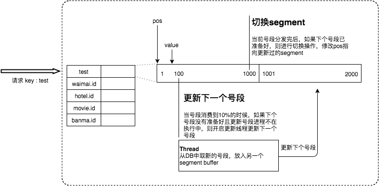

# ✅Leaf生成分布式ID的原理？

# 典型回答

Leaf是美团的分布式ID框架，他有2种生成ID的模式，分别是Snowflake和Segment。

**在Segment（号段）模式中**，他的意思就是每次去数据库中取ID的时候取出来一批，并放在缓存中，然后下一次生成新ID的时候就从缓存中取。这一批用完了再去数据库中拿新的。

而为了防止多个实例之间发生冲突，需要采用号段的方式，即给每个客户端发放的时候按号段分开，如客户端A取的号段是1-1000，客户端B取的是1001-2000，客户端C取的是2001-3000。当客户端A用完之后，再来取的时候取到的是3001-4000。

号段模式的好处是在同一个客户端中，生成的ID是顺序递增的。并且不需要频繁的访问数据库，也能提升获取ID的性能。

### 
这种模式的优点是，虽然依赖数据库，但是因为有号段缓存，所以在数据库宕机后的一段时间内也能保证可用性，并且这种模式不依赖时钟，所以不存在时钟回拨的问题。

缺点也比较明显，首先是如果多个缓存中刚好用完了号段，同时去请求数据库获取新的号段时可能会导致并发争抢影响性能，另外，DB如果宕机时间过长，缓存中号段耗尽也会有可用性问题。

为了解决多个号段用完之后取新的号段冲突，Leaf还引入了双buff，当号段消费到某个阈值时就异步的把下一个号段加载到内存中，而不需要定好耗尽才去更新，这样可以避免取号段的时候导致没有号码分配影响可用性及性能。

**在Snowflake模式中**，当然是基于基于Twitter的Snowflake算法实现的了。但是主要是针对Snowflake中存在的一些问题做了很多优化。

相对于Snowflake，Leaf 在以下几个方面进行了优化：

1. **数据中心ID和机器ID的配置方式**：Snowflake需要在代码中硬编码数据中心ID和机器ID，而Leaf通过配置文件的方式进行配置，可以动态配置数据中心ID和机器ID，降低了配置的难度。
2. 引入区间概念：Leaf引入了区间的概念，每次从zookeeper获取一段ID的数量（比如1万个），之后在这个区间内产生ID，避免了每次获取ID都要去zookeeper中获取，**减轻了对zookeeper的压力，并且也可以减少对ZK的依赖，并且也能提升生成ID的效率。**
3. 自适应调整：Leaf支持自适应调整ID生成器的参数，比如每个区间的ID数量、ID生成器的工作线程数量等，可以根据实际情况进行动态调整，提高了系统的性能和灵活性。
4. 支持多种语言：Leaf不仅提供了Java版本的ID生成器，还提供了Python和Go语言的版本，可以满足不同语言的开发需求。
5. **时钟回拨解决**：每个 Leaf 运行时定时向 zk 上报时间戳。每次 Leaf 服务启动时，先校验本机时间与上次发 ID 的时间，再校验与 zk 上所有节点的平均时间戳。如果任何一个阶段有异常，那么就启动失败报警。

Leaf的分布式ID生成过程可以简述如下：

1. Leaf生成器启动时，会从配置文件中读取配置信息，包括数据中心ID、机器ID等。
2. Leaf生成器会向zookeeper注册自己的信息，包括IP地址、端口号等。
3. 应用程序需要生成一个ID时，会向Leaf生成器发送一个请求。
4. Leaf生成器会从zookeeper中读取可用的区间信息，并分配一批ID。
5. Leaf生成器将分配的ID返回给应用程序。
6. 应用程序可以使用返回的ID生成具体的业务ID。
7. 当分配的ID用完后，Leaf生成器会再次向zookeeper请求新的区间。

> 原文: <https://www.yuque.com/hollis666/xkm7k3/hgzes2l7eomfmiqu>