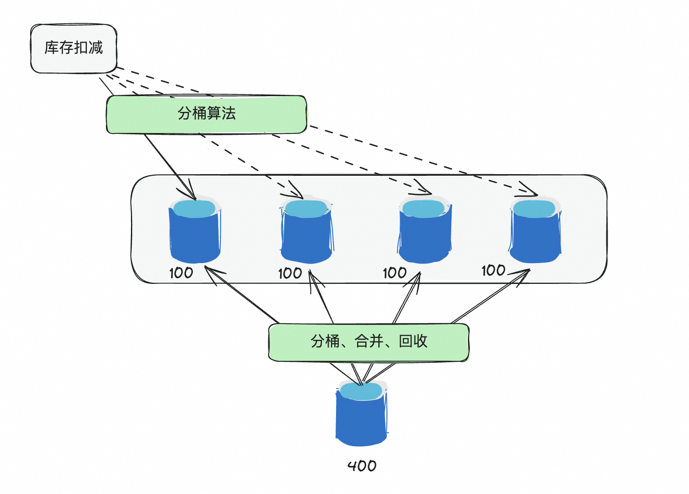

# ✅阿里的库存秒杀是如何实现的？

阿里有很多业务，几十上百个业务线，各自都有一些需要做抢购、秒杀、热点扣减的场景。他们都用哪些方案呢？

我看了很多资料，也找了很多人做交流，最终得到的结论是啥都有，主要总结几个主流的，在用的一些方案（主要是整体方案的介绍，具体细节就不展开说了，有的是太敏感不方便讲，有的是太复杂了先把主要的说了，后续需要的再展开）：

你比如说，一些并发量没那么高，比如只有几千的，基本上是用mysql在抗的。但是你要是以为这个mysql和你用的mysql是一样的，那你会发现热点行更新在几百QPS的时候CPU就直接被拉满了。

那我们的mysql呢，是加了个自研了一个补丁（就是下面这篇文章中的技术方案），这个补丁可以识别出热点行及热点SQL，再给这些SQL分组，然后一个组内的多个SQL就可以减少加锁次数、减少B+树的遍历、以及通过组提交减少事务提交次数。就能扛更高的并发。

[✅阿里的数据库能抗秒杀的原理](https://www.yuque.com/hollis666/xkm7k3/nkzgdr7lgi14g9e3)

但是如果有些场景的QPS达到数万级别了，只靠数据库肯定是不行了。于是有一些营销平台或者额度系统，就会采用分桶的策略。就是将单个1000的库存拆分成10个100的库存，这样就可以把并发提升10倍。当然，这里还需要考虑如何均匀分配，如何解决碎片，如何做分桶间调度以及如何做动态扩容等问题。然后有些团队就专门研发了库存调度系统来解决这些问题。

另外，在一些本地生活类的电商场景，比较常用的方案就是缓存+数据库的策略，也就是在缓存做预扣减，然后异步通知到数据库再做扣减。这种方案就是需要考虑数据的一致性、缓存的不可用等问题。

那对于那种需要抗几百万QPS的电商大促场景，基本上就是各种方案的结合了。热点库、SQL合并执行、缓存、以及分桶基本都是结合着来的。而且这里的缓存，又有分布式缓存、本地缓存，以及把分布式缓存和服务器部署在一起搞一个近端缓存。总之就是各种方案每一个抗一点并发，加到一起抗的就多了。

我还了解到还有一些物流的仓库管理场景，设计了自己的分布式事务+应用层排队框架，来减少在数据库层面的热点更新，方案听上去也挺牛逼的。

看了这么多之后，到底哪种方案最好？又经过77四十九天的研究，我终于悟了，适合的才是最好的。

根据具体的业务形态、并发量、团队成员的技术能力、基础建设的情况等等选择相对合适的就行了。但是不管咋说，复杂度和并发量一定是成正比的。

> 原文: <https://www.yuque.com/hollis666/xkm7k3/ov1u9td0rpqb67dc>