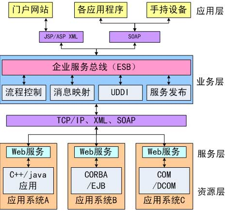
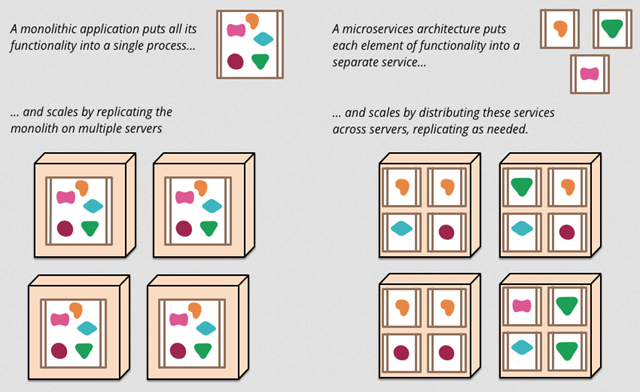

# ✅SOA和微服务之间的主要区别是什么？

# 典型回答
其实SOA和微服务就是差不多的。


SOA关注的是服务重用，微服务在关注服务重用的同时，也同时关注快速交付；


**微服务不再强调传统SOA架构里面比较重的ESB企业服务总线**。微服务把所有的“思考”逻辑包括路由、消息解析等放在服务内部，去掉一个大一统的ESB，服务间轻通信，是比SOA更彻底的拆分。（可以看看这篇文章，我觉得写的挺好的：[微服务（Microservice）那点事](https://yq.aliyun.com/articles/2764)）


# 扩展知识


## 面向服务的架构
面向服务架构（Service-Oriented Architecture，SOA）又称“面向服务的体系结构”，是Gartner于20世纪90年代中期提出的面向服务架构的概念。


面向服务架构，从语义上说，它与面向过程、面向对象、面向组件一样，是一种软件组建及开发的方式。与以往的软件开发、架构模式一样，SOA只是一种体系、一种思想，而不是某种具体的软件产品。





这里，我们通过一个例子来解释一下到底什么是SOA？如何做到SOA？


### 什么是SOA
SOA也可以说是一种是设计原则（模式），那么它包含哪些内容呢？事实上，这方面并没有最标准的答案，多数是遵从著名SOA专家Thomas Erl的归纳：


> 标准化的服务契约 Standardized service contract
>
> 服务的松耦合 Service loose coupling
>
> 服务的抽象 Service abstraction
>
> 服务的可重用性 Service reusability
>
> 服务的自治性 Service autonomy
>
> 服务的无状态性 Service statelessness
>
> 服务的可发现性 Service discoverability
>
> 服务的可组合性 Service composability
>


这些原则总的来说要达到的目的是：提高软件的重用性，减少开发和维护的成本，最终增加一个公司业务的敏捷度。


既然是面向服务的架构，那么我们就先来定义一个服务，

```plain
public interface Echo {
    String echo(String text);
}

public class EchoImpl implements Echo {
    public String echo(String text) {
        return text;
    }
}
```


上面这段代码相信有过JavaWeb开发经验的人都不会陌生。就是定义了一个服务的接口和实现。


那么，定义了服务，我们就做到了SOA了么？


我们用Thomas Erl定义的原则来对比一下，用松耦合和可重用这几个原则来尝试分析一下上面Echo示例：


> Echo的服务契约是用Java接口定义，而不是一种与平台和语言无关的标准化协议，如WSDL，CORBA IDL。当然可以抬杠，Java也是行业标准，甚至全国牙防组一致认定的东西也是行业标准。
>
> 
>
> Java接口大大加重了与Service客户端的耦合度，即要求客户端必须也是Java，或者JVM上的动态语言（如Groovy、Jython）等等……
>
> 
>
> 同时，Echo是一个Java的本地接口，就要求调用者最好在同一个JVM进程之内……
>
> 
>
> Echo的业务逻辑虽然简单独立，但以上技术方面的局限就导致它无法以后在其他场合被轻易重用，比如分布式环境，异构平台等等 ESB是SCA思想实现的基础设施。ESB主要作用是集中注册发布服务，为服务与传输协议之间解耦。并不是所有的SOA架构都需要ESB，ESB是SCA特有的。当然任何符合ESB特征的解决方式都可以称之为ESB，也不仅仅是SCA内部的。
>


因此，我们可以认为Echo并不太符合SOA的基本设计原则。


### 实现SOA
修改一下上面的Echo，添加Java EE的@WebServices注解


```plain
@WebServices
public class EchoImpl implements Echo {
    public String echo(String text) {
        return text;
    }
}
```


现在将Echo发布为Java WebServices，并由底层框架自动生成WSDL来作为标准化的服务契约，这样就能与远程的各种语言和平台互操作了，较好的解决了上面提到的松耦合和可重用的问题。按照一般的理解，Echo似乎就成为比较理想的SOA service了。


使用WebServices只是一种相对简单的方案，SOA的最常见的解决方案是SCA，其次还有JBI，BPEL等。ESB是SCA思想实现的基础设施。ESB主要作用是集中注册发布服务，为服务与传输协议之间解耦。关于SCA和ESB并不是本文的重点，感兴趣的朋友可以从网络上获取更多资料。(可以从上图中看到ESB在整个SOA架构中所扮演的角色)


### 面向对象和面向服务的对比
面向对象（OO）和面向服务（SO）在基础理念上有大量共通之处，比如都尽可能追求抽象、封装和低耦合。

但SO相对于OO，又有非常不同的典型应用场景，比如：


+ 多数OO接口（interface）都只被有限的人使用（比如团队和部门内），而SO接口（或者叫契约）一般来说都不应该对使用者的范围作出太多的限定和假设（可以是不同部门，不同企业，不同国家）。还记得贝佐斯原则吗？“团队必须做好规划与设计，以便未来把接口开放给全世界的程序员，没有任何例外”。
+ 多数OO接口都只在进程内被访问，而SO接口通常都是被远程调用。
+ 

简单讲，就是SO接口使用范围比一般OO接口可能广泛得多。我们用网站打个比方：一个大型网站的web界面就是它整个系统入口点和边界，可能要面对全世界的访问者（所以经常会做国际化之类的工作），而系统内部传统的OO接口和程序则被隐藏在web界面之后，只被内部较小范围使用。而理想的SO接口和web界面一样，也是变成系统入口和边界，可能要对全世界开发者开放，因此SO在设计开发之中与OO相比其实会有很多不同。（[微观SOA：服务设计原则及其实践方式（上篇）](http://www.infoq.com/cn/articles/micro-soa-1)）


## 微服务架构
微服务架构(MicroService)是一种服务化架构风格，通过将功能分散到各个离散的服务中以实现对解决方案的解耦。微服务架构强调的第一个重点就是业务系统需要彻底的组件化和服务化（这也是我们为什么要先介绍组件化和服务化的原因）。微服务的诞生并非偶然。它是互联网高速发展，敏捷、精益、持续交付方法论的深入人心，虚拟化技术与DevOps文化的快速发展以及传统单体架构无法适应快速变化等多重因素的推动下所诞生的产物。




微服务的流行，Martin功不可没，先看看他是如何定义微服务的：


> The microservice architectural style is an approach to developing a single application as a suite of small services, each running in its own process and communicating with lightweight mechanisms, often an HTTP resource API. These services are built around business capabilities and independently deployable by fully automated deployment machinery. There is a bare minimum of centralized management of these services , which may be written in different programming languages and use different data storage technologies.
>


总结起来大概以下四点：

+ 一系列的独立的服务共同组成系统
+ 单独部署，跑在自己的进程里
+ 每个服务为独立的业务开发
+ 分布式的管理

Martin自己也说了，每个人对微服务都可以有自己的理解，不过大概的标准还是有一些的。

+ 分布式服务组成的系统
+ 按照业务而不是技术来划分组织
+ 做有生命的产品而不是项目
+ Smart endpoints and dumb pipes（我的理解是强服务个体和弱通信）
+ 自动化运维（DevOps）
+ 容错
+ 快速演化


> 原文: <https://www.yuque.com/hollis666/xkm7k3/fkg3572ih9pye728>