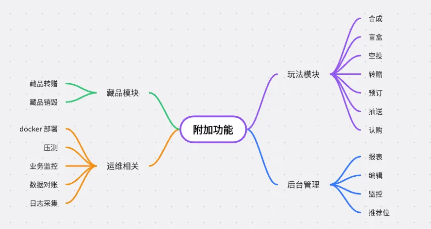

# 🧣🧣🧣项目实战课介绍&老用户福利

兄弟们，除了这个主要讲解面试题+原理的八股文之外，最近我还出了个项目实战课。

实战课的主要定位是实战，就是一些我们八股文中涉及到的一些知识的实际应用，主要是一个SpringCloud的微服务类型的项目，里面有各种分布式事务、分库分表、缓存一致性、多级缓存、虚拟线程、热点更新等等的实际应用和结合场景的问题解决。

下面是关于这个实战课的介绍，现在我们价格还是比较低的，但是还是要给咱们的老用户一张专属优惠券，大家可以通过以下链接（或者抖音扫码）领取专属优惠券（活动有效期截止到9.30，数量有限，先到先得）：

（[https://haohuo.jinritemai.com/views/coupon/obtain?coupon_meta_id=qWvhGteYtFjhsYh](https://haohuo.jinritemai.com/views/coupon/obtain?coupon_meta_id=qWvhGteYtFjhsYh) ）

**扫描上方二维码到手价179，应该是历史最低价格了，后续不太可能会有这个价格了，大家需要的抓紧上车。（如果你已经花超过这个价格购买过了，可以联系客服退差价，同样也是仅限9.30之前哦）**

这是一个具有**高并发、大流量、分布式、秒杀等场景的分布式电商+区块链组成的数字藏品类项目**。是目前市面上唯一的数字藏品交易平台。

以下是一些大家关心的问题，注意回答一下。  

**都有哪些技术**  

这个项目用到了目前市面上最主流的 SpringCloudAlibaba 的技术栈，用到的框架都是目前的最新版+稳定版。**  
**

**后端主要用到了像 JDK 21、Spring 6.1、SpringCloud 2023、Nacos、Sentinel、Dubbo、Redis、XXL-JOB、RocketMQ、ShardingJDBC、Druid、MySQL、EslasticSearch、Canal、 Seata、SaToken 等中间件及技术，还用到了像 Hutool、Logback、Caffeine、Mybatis、MybatisPlus、FastJson2等常用的开源框架。****  
**

前端主要以 Vue、UniApp、JavaScript 为主。  

在技术方案上，主要涉及到了各种分布式、微服务、高并发、高可用等相关技术列表。  

比如**分布式事务、分布式 Session、分布式 ID、分布式锁、分布式任务、分布式缓存等等，以及像分库分表、多级缓存、搜索引擎**等等。并且实现了很多有难度的功能，如**秒杀、关单、排行榜**等等很多很多。

而且这些技术的应用都是基于实际场景选择的不同方案，比如**分布式事务，我们项目中共用到了4种方案**。脱离场景谈方案都是耍流氓，所以我们是结合场景的实际可落地方案。  

  

**都有哪些功能**  

目前，我们的项目的主要的功能，如用户、网关、认证、订单、支付等等功能都已经完成了，项目已经**完全可以运行起来**。**  
**

但是项目目前是<u>未完结状态</u>，所以还有一些其他的附加功能我们还在不断开发中，如盲盒、空投、预订等玩法，以及监控、压测、对账等运维相关需求。

我们会在接下来的3个月左右把这些功能完结。但是现在已有的功能，其实主流业务都已经能跑通了，现在给你的也是可以运行的，只是一些附加功能还没有而已，其实无伤大雅。

  

**交付哪些内容**

为了让大家能够更好地学习，我们的项目给大家交付的内容包括了**代码+视频+文档+答疑**。

**代码**目前是主流功能都完成的前端+后端代码，放在 git 上统一管理，大家可以自己拉分支以及提交 PR，我的更新你也能直接拉取到本地。

我们的项目讲解也是围绕着我们提供的后端代码进行的，但是需要注意的是前端代码只做演示，暂时不做详细讲解。

**文档**的话目前已经有170+篇了，主要的设计文档、最佳实践、常见问题、关键技术等等在文档中都已经更新完了。还有一些面试相关内容也都有。都可以直接看了。  

**视频**目前更新了110+期，其中中间件部署、项目搭建、网关、认证、用户、藏品等模块的视频都更新完了，目前正在更新订单模块。预计在8月份会把最核心的订单模块更新完成。

视频主要是针对项目内容进行的视频讲解，主要讲解形式是通过 Debug 的方式逐行进行代码讲解，讲解设计原理、代码实现以及扩展知识。同时兼顾细节及效率。  

同时我们给大家有安排**答疑群**，以及知识星球，大家可以在群里进行互动和交流，也可以在星球中进行讨论。目前氛围都是很好的，我也会积极地解决大家遇到的各种问题。

  

**什么时候更新完**

这个项目目前还在更新中，**预计会在接下来的3个月左右时间完成代码的开发、文档和视频的更新。**

更新完之后，有效代码行数应该在3万行左右，视频和文档都在200集左右。文档总字数大概20万字左右，视频的总时长大概在2000分钟左右。  

  

**如何购买，怎么看课**

这个项目因为目前刚刚推出，还是一个首发价，当前的**价格是179**，这个价格不是一年的价格，是**永久**的。

这和网上动辄几千块钱或者几百块一年的项目要便宜多了。主打的就是性价比。

**无论从项目的复杂度、技术栈的完整度、交付的内容、技术的挑战等等方面，可以说是吊打市面上各种社区系统、管理系统、脚手架以及烂大街的电商项目的。**

你要说缺点，**唯一的缺点就是还没更新完，所以等他更新完之后，价格一定比现在要高的多的多。**

购买的方式目前大家可以通过下方的二维码下单，下单后会有短信提示，然后你就可以根据提示操作，申请代码、视频、文档的权限了。  

（抖音扫码领取专属优惠券）  

我们的代码和文档是统一管理的，在一个地方查看，你按照短信提示提示申请开通权限，然后联系客服审批通过即可，主要的学习方式是通过电脑学习，因为毕竟你用手机没办法看代码的。

视频是单独的，也是给你开通账号权限，这个不需要审批，短信内链接你申请下即可立即开通。手机电脑都能看。手机效果更好一点（视频前面有几期不是特别高清，因为影响不大我还没抽出时间来重新录，大家可以看后面的讲解代码部分，清晰度都是很高的。）

  

**适合谁看**

这个项目是一个微服务的技术栈，所以其实内容还是挺多的，想要学明白，还是有一定的门槛的，所以，**对于0基础的人不适合！**

**除了0基础以外，其他人都能学，因为项目中我有很多模块，不同的模块遇到的挑战、用到的技术都不一样，你可以按照我划分的难度进行选择性学习。**

如果你是以下5种情况之一，这个项目都非常适合你：

**1、有 Java 基础但是没有真实的项目经历**

**2、有项目经历，但是自己的项目太水没亮点**

**3、日常工作都是在做 CRUD，没有技术难点**

**4、希望学习并掌握当今最新的 SpringCloud 技术栈**

**5、想学习高并发、大流量等场景的解决方案落地实践**

****

（抖音扫码领取专属优惠券）

> 原文: <https://www.yuque.com/hollis666/xkm7k3/dgolk0cckpb94sia>