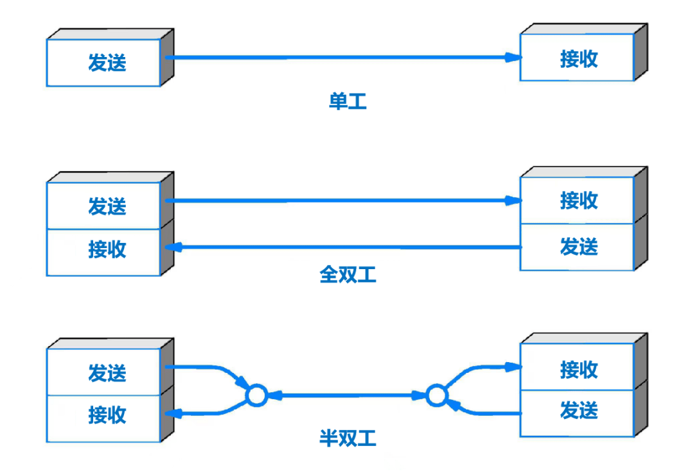

# ✅什么是全双工和半双工

# 典型回答

单工、半双工和全双工是通信中两种基本的传输模式，描述了数据在通信双方之间的流动方式。

1. **单工****：** 单工通信只允许数据在一个方向上传输，即只能从一个点向另一个点发送数据。**通信的一方只能发送，而另一方只能接收。** 一般的广播电台是单工通信的例子，听众只能接收广播，无法向电台发送信息。

2. **半双工： 在半双工通信中，数据可以在通信双方之间双向传输，但不能同时进行。换句话说，通信的两端可以交替地发送和接收数据，但不能同时进行这两个操作。类比于对讲机，一方说话时另一方只能听，不能同时说话。**

****

3. **全双工： 在全双工通信中，数据可以在通信双方之间双向同时传输。每一方都可以独立地发送和接收数据，而且这两个操作可以同时进行。类比于电话，两个人可以同时说话而互不干扰。**

计算机之间通过网络进行通信时，可以使用全双工通信。例如，TCP连接允许数据在两个方向上同时传输。

选择半双工还是全双工通信取决于具体的应用需求和通信设备的能力。在一些场景中，例如对讲机通信，半双工可能足够满足需求。在其他场景中，例如网络通信和电话通信，通常使用全双工以提供更高的效率和实时性。

> 原文: <https://www.yuque.com/hollis666/xkm7k3/mnq17i>