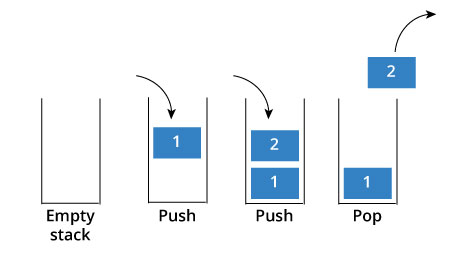
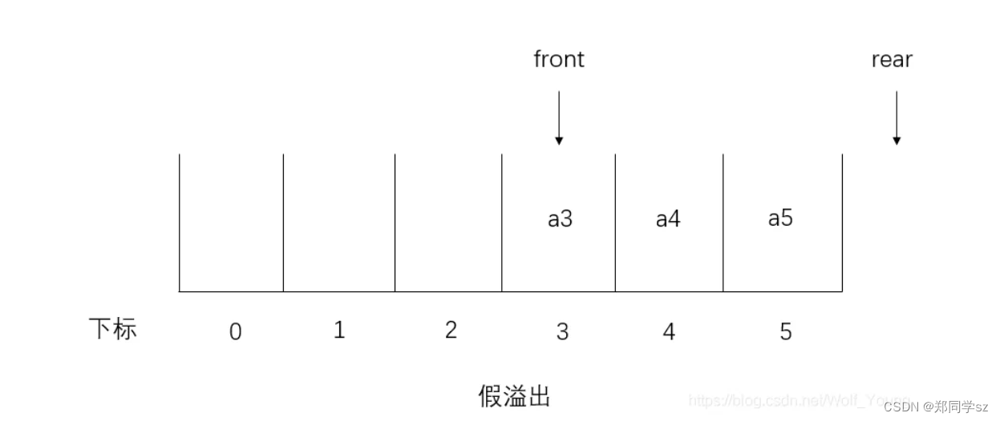

# ✅栈和队列的区别

# 典型回答
栈和队列从定义上来讲，只有一个不同，就是**栈是先进后出的，而队列是先进先出的。**网上有一个形象的例子，说栈是吃了吐，队列则是吃了拉，哈哈哈。两者不的不同如下所图所示：


栈：




队列：


## 栈和队列的实现
从实现上来说，栈和队列都可以用数组或者链表实现，不过从实现难度和时空复杂度的角度考虑，一般来说，栈会用数组实现，队列会用链表实现。如下所示：

```java
class StackByArray {
    private int top = -1;
    private int maxSize;
    private int[] stack;

    public ArrayStack(int maxSize){
        this.maxSize = maxSize;
        stack = new int[maxSize];
    }

    public boolean isFull(){
        return top == maxSize - 1;
    }

    public boolean isEmpty(){
        return top == -1;
    }

    public void push(int data){
        if (isFull()){
            return;
        }
        stack[++top] = data;
    }

    public int pop () {
        if (isEmpty()){
            throw new RuntimeException("this stack is empty");
        }
        int data = stack[top--];
        return data;
    }
}
class StackByLink {

    private Node head;

    public void push(int data) {
        Node temp = new Node(data);
        if(head != null) {
            temp.next = head;
        }
        head = temp;
    }

    public int pop() {
        if(head == null) {
            return 0;
        }
        int ans = head.data;
        head = head.next;
        return ans;
    }

    private static class Node {
        public int data;
        public Node next;
        public Node(int data) {
            this.data = data;
        }
    }
}
```


```java
class QueueByLink {
    
    Node front;
    Node tail;
    int size;
    
    public void offer(int data){
        Node temp = new Node(data);
        if(isEmpty()){
            front = temp;
            tail = front;
        } else {
            tail.next = temp;
        	tail = temp;
        }
        size++;
    }

    public int poll(){
        if(isEmpty()){
            return 0;
        }
        int data = front.data;
        front = front.next;
        size --;
        return data;
    }

    public boolean isEmpty(){
        return size == 0;
    }

    private static class Node {
        public int data;
        public Node next;
        public Node(int data) {
            this.data = data;
        }
    }
}
```

在Java中，常见的栈有Stack，Deque(implemented by LinkedList)，常见的队列有Queue和Queue（implemented by LinkedList）所以我们一般刷题的时候，常常会用下面的写法：

```java
Stack<Integer> stack = new Stack<>();
stack.push(1);
stack.pop();
Queue<Integer> queue = new LinkedList<>();
queue.offer(1);
queue.poll();
```

## 应用
栈和队列在日常开发过程中无处不在。


**我们平常所使用的递归，就是通过栈来实现的**。同时还有JVM中的方法在执行的时候，也会放到栈上，因为他们的执行顺序都是遵循先进后出的


**队列常常作为缓冲区来使用，像我们熟知的生产者和消费者模型**，生产者完成任务后，会把数据存放到队列中，等待消费者来读取。

# 知识扩展
## 什么是双端队列和循环队列
### 双端队列
队列还有一种变形的结构叫双端队列，所谓的双端，就是说该队列不仅遵循FIFO原则，通常也可以按照使用者的想法从队首或者队尾进行插入和删除

```java
Deque<Integer> deque = new LinkedList<>();
deque.offerFirst(1);
deque.offerLast(1);
deque.pollFirst();
deque.pollLast();
```

### 循环队列
一般情况下，数组是不能实现队列的，因为先进先出，可能会存在假溢出的情况，所以数组的空间一定会被浪费。所以，我们会通过循环的方式，当最尾部的索引到达length之后，我们会将该索引重新置为0，以此来重复利用数组的空间。而这样一种形式，就会造成一种逻辑循环，也就是我们说的循环队，假溢出如下所示：



代码如下：

```java
class QueueByArray {
	private final int[] items;
	private int head=0;
	private int tail=0;
    
	public boolean push(int data) {
		if(((tail + 1) % items.length) == head) {
            // 此时说明队列的空间已经满了，只能扩容
			return false;
		}
		else {	
			items[tail] = data;
			tail = (tail+1) % items.length;
			return true;
		}
	}
	public int pop() {
		int data = items[head];
		head = (head+1) % items.length;
		return data;
	}
	public QueueByArray(int length) {
		this.items = new int[length];
    }
}
```

一般来说，循环队列可以作为缓冲区使用，如果index超出，直接覆盖就可以了。


## 栈实现队列


[✅如何用栈实现一个队列？](https://www.yuque.com/hollis666/xkm7k3/uz4sam5iyt87ngcn)

## 队列实现栈


[✅如何用队列实现一个栈？](https://www.yuque.com/hollis666/xkm7k3/nu9bn65b620v4gg7)

## 相关算法
1. 用栈实现队列：[https://leetcode.cn/problems/yong-liang-ge-zhan-shi-xian-dui-lie-lcof/](https://leetcode.cn/problems/yong-liang-ge-zhan-shi-xian-dui-lie-lcof/)
2. 用队列实现栈：[https://leetcode.cn/problems/implement-stack-using-queues/](https://leetcode.cn/problems/implement-stack-using-queues/)
3. 最小栈：[https://leetcode.cn/problems/min-stack/](https://leetcode.cn/problems/min-stack/)
4. 双端队列：[https://leetcode.cn/problems/design-circular-deque/](https://leetcode.cn/problems/design-circular-deque/)


> 原文: <https://www.yuque.com/hollis666/xkm7k3/szy3scp8dbucxd0m>