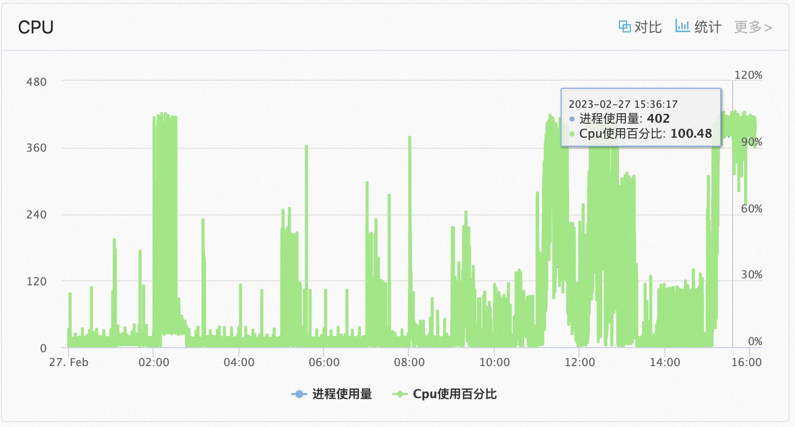
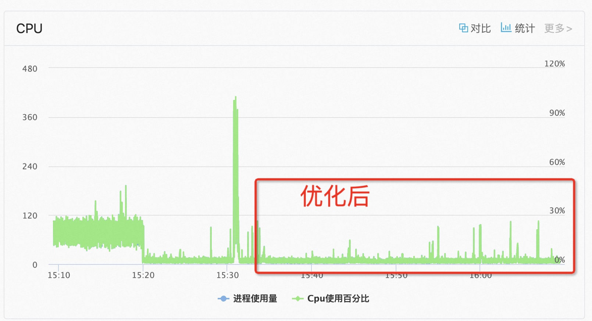

# ✅数据库CPU被打满排查过程

### 问题发现


最近，经常收到一些数据库的报警，提示我们的数据库的CPU有异常飙高的情况，通过该监控发现，确实间歇性的有一些CPU飙高的情况，经常把CPU打满了。





### 问题排查


通过监控进一步查看，发现在CPU飙高的同时，有大量SQL的锁耗时比较长，平均在1.5秒左右，并且在业务高峰期经常要4s-5s：


具体查看SQL的话，会发现是一些update语句导致的：


主要的SQL内容在下面，其中我们的更新条件，number是有唯一性索引的：


```plain
SET gmt_modified = now(), business_type_enum = ?, product_type_enum = ?
WHERE number = ?
```


经过分析SQL语句，结合前面我们看到的这**条SQL语句大量的耗时都在锁等待上面**。现象比较明显了，那问题根据猜测，大概率是出现在多个线程同时尝试更新同一行记录的时候。


因为**InnoDB会在update的时候自动给行记录加锁，以防止其他线程同时更新该行记录。如果多个线程同时尝试更新同一行记录，那么没拿到锁的线程就必须等待持有锁的线程释放锁后才能继续更新该行记录。**

****

[✅MySQL热点数据更新会带来哪些问题？](https://www.yuque.com/hollis666/xkm7k3/gccycd2mvmpthq1s)


思路大致有了，再结合我们的实际业务情况，基本可以确定之所以导致CPU飙高就是因为并发修改同一条记录导致的锁等待，进而导致的CPU飙高。


因为CPU飙高的几个时间点，都是我们有一个合案任务在执行，合案任务的逻辑是这样的：


定时扫描所有风控策略流入的存在欺诈风险的订单及用户数据(fraud_risk_order)，然后把这些数据，基于用户维度进行合并，并且合并后要把多条其他明细数据组合在同一条用于审核的欺诈审核单(fraud_audit_order)上。


伪代码：

```plain
for(fraud_risk_order : fraud_risk_orders){

	update fraud_audit_order set xxx = 'xx' where fraud_audit_order_no = "同一个单号"
}
```


而这个问题之前没有出现，是在我最近刚刚做过一次合案任务的性能优化，使用网格任务分布式的进行合案之后才频繁出现的。


主要就是任务的性能好了，扫表扫的快了，如果同一个用户名下的欺诈风险单比较多的话，就会并发的去修改同一条审核单。这就会导致并发冲突。


### 问题解决


问题定位到以后，就要想办法解决了。


结合我们自己的业务情况，优化的方案也很简单，就是不要单条单条的去修改审核单，而是先进行一次预合案，然后再批量一次执行更新，并把结果合并到一条审核单上即可。


预合案的方案主要是基于数据库写SQL做的，大致思路如下：


```plain
select
        product_type_enum,
        subject_id,
        subject_id_enum,
        GROUP_CONCAT(distinct(submitter) SEPARATOR ',') as submitters,
        GROUP_CONCAT(distinct(number) SEPARATOR ',') as risk_order_numbers,
        GROUP_CONCAT(distinct(risk_level_enum) SEPARATOR ',') as risk_level_enums ,
        GROUP_CONCAT(distinct(risk_category) SEPARATOR ',') as category_codes

        from fraud_risk_order
        where 
            product_type_enum = "XXX"
            and risk_order_status_enum = 'DRAFT'
        group by subject_id_enum,subject_id
```


通过上面的SQL，我们把各个需要合并的数据，基于主体ID和主体类型进行了聚合，并且把需要聚合到一起的字段，如submitter，通过GROUP_CONCAT函数进行逗号分隔开组成一个字符串。


然后在代码的合案逻辑中，进行如下操作：


```plain
public class AuditOrder{

    public void merge(RiskOrderMergeInfo riskOrderMergeInfo) {

        RiskLevelEnum  currentRiskLevelEnum = Arrays.stream(riskOrderMergeInfo.getRiskLevelEnums().split(","))
                .map(RiskLevelEnum::valueOf)
                .max(Comparator.comparing(RiskLevelEnum::getWeights))
                .orElse(RiskLevelEnum.LOW);

        this.riskLevelEnum = Stream.of(this.riskLevelEnum, currentRiskLevelEnum).max(Comparator.comparing(RiskLevelEnum::getWeights)).orElse(RiskLevelEnum.LOW);
    }

}
```


就是把上面的SQL中返回的信息，和已有的审核单进行合并，合并后只需要进行一次更新即可。


因为在上面的SQL中，我同时把本次合并涉及到的风险单（fraud_risk_order）的单号（number）也返回了，所以针对这些单据我也可以通过一条SQL进行批量的推进状态。


经过以上代码优化后，不仅CPU飙高的问题解决了，合案任务的执行效率也大大提高了。原来需要跑2小时，现在只需要10分钟不到。





> 原文: <https://www.yuque.com/hollis666/xkm7k3/yhfy70xlf7kegk0s>