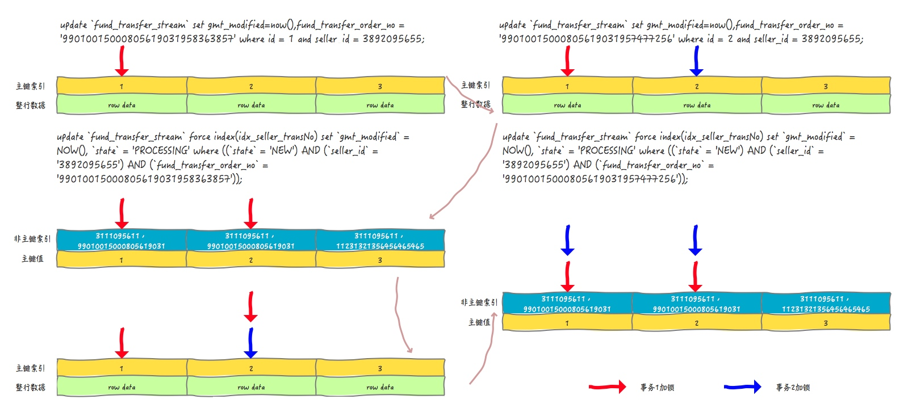

# ✅数据库死锁问题排查过程


（这个问题我排查了很久，期间也找很多DBA帮忙排查过，但是最终还是靠自己断断续续排查了一个月的时间才定位到，问题还是挺有意思的，大家可以看看。如果看不懂我觉得也没关系，因为他牵扯到的内容比较多，需要一些背景知识，后面再回过头来看就好了）


### 现象


某天晚上，同事正在发布，突然线上大量报警，很多是关于数据库死锁的，报警提示信息如下：


```plain
{"errorCode":"SYSTEM_ERROR","errorMsg":"nested exception is org.apache.ibatis.exceptions.PersistenceException: 

Error updating database. Cause: ERR-CODE: [TDDL-4614][ERR_EXECUTE_ON_MYSQL] 

Deadlock found when trying to get lock; 

The error occurred while setting parameters\n### SQL: 

update fund_transfer_stream set gmt_modified=now(),state = ? where fund_transfer_order_no = ? and seller_id = ? and state = 'NEW'
```


通过报警，我们基本可以定位到发生死锁的数据库以及数据库表。先来介绍下本文案例中涉及到的数据库相关信息。


### 背景情况


我们使用的数据库是Mysql 5.7，引擎是InnoDB，事务隔离级别是READ-COMMITED。


数据库版本查询方法：


```plain
SELECT version();
```


引擎查询方法：


```plain
show create table fund_transfer_stream;
```


建表语句中会显示存储引擎信息，形如：`ENGINE=InnoDB`


事务隔离级别查询方法：


```plain
select @@tx_isolation;
```


事务隔离级别设置方法（只对当前Session生效）：


```plain
set session transaction isolation level read committed;
```


PS：注意，如果数据库是分库的，以上几条SQL语句需要在单库上执行，不要在逻辑库执行。


发生死锁的表结构及索引情况（隐去了部分无关字段和索引）：


```plain
CREATE TABLE `fund_transfer_stream` ( 
  `id` bigint(20) unsigned NOT NULL AUTO_INCREMENT COMMENT '主键',
  `gmt_create` datetime NOT NULL COMMENT '创建时间',
  `gmt_modified` datetime NOT NULL COMMENT '修改时间', 
  `pay_scene_name` varchar(256) NOT NULL COMMENT '支付场景名称', 
  `pay_scene_version` varchar(256) DEFAULT NULL COMMENT '支付场景版本',
  `identifier` varchar(256) NOT NULL COMMENT '唯一性标识',
  `seller_id` varchar(64) NOT NULL COMMENT '卖家Id',
  `state` varchar(64) DEFAULT NULL COMMENT '状态', `fund_transfer_order_no` varchar(256) 
  DEFAULT NULL COMMENT '资金平台返回的状态', 
  PRIMARY KEY (`id`),
  KEY `idx_seller` (`seller_id`),
  KEY `idx_seller_transNo` (`seller_id`,`fund_transfer_order_no`(20))
  ) ENGINE=InnoDB DEFAULT CHARSET=utf8mb4 COMMENT='资金流水';
```


该数据库共有三个索引，1个聚簇索引（主键索引），2个非聚簇索（非主键索引）引。


聚簇索引：


```plain
PRIMARY KEY (`id`)
```


非聚簇索引：


```plain
KEY `idx_seller` (`seller_id`),

KEY `idx_seller_transNo` (`seller_id`,`fund_transfer_order_no`(20))
```


以上两个索引，其实idx_seller_transNo已经覆盖到了idx_seller，由于历史原因，因为该表以seller_id分表，所以是先有的idx_seller，后有的idx_seller_transNo


### 死锁日志


当数据库发生死锁时，可以通过以下命令获取死锁日志：


```plain
show engine innodb status
```


发生死锁，第一时间查看死锁日志，得到死锁日志内容如下：


```plain
Transactions deadlock detected, dumping detailed information.
2019-03-19T21:44:23.516263+08:00 5877341 [Note] InnoDB: 

*** (1) TRANSACTION:
TRANSACTION 173268495, ACTIVE 0 sec fetching rows
mysql tables in use 1, locked 1
LOCK WAIT 304 lock struct(s), heap size 41168, 6 row lock(s), undo log entries 1
MySQL thread id 5877358, OS thread handle 47356539049728, query id 557970181 11.183.244.150 fin_instant_app updating

update `fund_transfer_stream` set `gmt_modified` = NOW(), `state` = 'PROCESSING' where ((`state` = 'NEW') AND (`seller_id` = '38921111') AND (`fund_transfer_order_no` = '99010015000805619031958363857'))
2019-03-19T21:44:23.516321+08:00 5877341 [Note] InnoDB: 

*** (1) HOLDS THE LOCK(S):
RECORD LOCKS space id 173 page no 13726 n bits 248 index idx_seller_transNo of table `xxx`.`fund_transfer_stream` trx id 173268495 lock_mode X locks rec but not gap
Record lock, heap no 168 PHYSICAL RECORD: n_fields 3; compact format; info bits 0

2019-03-19T21:44:23.516565+08:00 5877341 [Note] InnoDB: 

*** (1) WAITING FOR THIS LOCK TO BE GRANTED:
RECORD LOCKS space id 173 page no 12416 n bits 128 index PRIMARY of table `xxx`.`fund_transfer_stream` trx id 173268495 lock_mode X locks rec but not gap waiting
Record lock, heap no 56 PHYSICAL RECORD: n_fields 17; compact format; info bits 0
2019-03-19T21:44:23.517793+08:00 5877341 [Note] InnoDB: 

*** (2) TRANSACTION:
TRANSACTION 173268500, ACTIVE 0 sec fetching rows, thread declared inside InnoDB 81
mysql tables in use 1, locked 1
302 lock struct(s), heap size 41168, 2 row lock(s), undo log entries 1
MySQL thread id 5877341, OS thread handle 47362313119488, query id 557970189 11.131.81.107 fin_instant_app updating

update `fund_transfer_stream_0056` set `gmt_modified` = NOW(), `state` = 'PROCESSING' where ((`state` = 'NEW') AND (`seller_id` = '38921111') AND (`fund_transfer_order_no` = '99010015000805619031957477256'))
2019-03-19T21:44:23.517855+08:00 5877341 [Note] InnoDB: 

*** (2) HOLDS THE LOCK(S):
RECORD LOCKS space id 173 page no 12416 n bits 128 index PRIMARY of table `fin_instant_0003`.`fund_transfer_stream_0056` trx id 173268500 lock_mode X locks rec but not gap
Record lock, heap no 56 PHYSICAL RECORD: n_fields 17; compact format; info bits 0

2019-03-19T21:44:23.519053+08:00 5877341 [Note] InnoDB: 

*** (2) WAITING FOR THIS LOCK TO BE GRANTED:
RECORD LOCKS space id 173 page no 13726 n bits 248 index idx_seller_transNo of table `fin_instant_0003`.`fund_transfer_stream_0056` trx id 173268500 lock_mode X locks rec but not gap waiting
Record lock, heap no 168 PHYSICAL RECORD: n_fields 3; compact format; info bits 0

2019-03-19T21:44:23.519297+08:00 5877341 [Note] InnoDB: *** WE ROLL BACK TRANSACTION (2)
```


简单解读一下死锁日志，可以得到以下信息：


1、导致死锁的两条SQL语句分别是：


```plain
update `fund_transfer_stream_0056` 
set `gmt_modified` = NOW(), `state` = 'PROCESSING' 
where ((`state` = 'NEW') AND (`seller_id` = '38921111') AND (`fund_transfer_order_no` = '99010015000805619031957477256'))
```


和


```plain
update `fund_transfer_stream_0056` 
set `gmt_modified` = NOW(), `state` = 'PROCESSING' 
where ((`state` = 'NEW') AND (`seller_id` = '38921111') AND (`fund_transfer_order_no` = '99010015000805619031958363857'))
```


2、事务1，持有索引idx_seller_transNo的锁，在等待获取PRIMARY的锁。


3、事务2，持有PRIMARY的锁，在等待获取idx_seller_transNo的锁。


4、因事务1和事务2之间发生循环等待，故发生死锁。


5、事务1和事务2当前持有的锁均为：`lock_mode X locks rec but not gap`


两个事务对记录加的都是X 锁，No Gap锁，即对当行记录加锁，并未加间隙锁。


> X锁：排他锁、又称写锁。若事务T对数据对象A加上X锁，事务T可以读A也可以修改A，其他事务不能再对A加任何锁，直到T释放A上的锁。这保证了其他事务在T释放A上的锁之前不能再读取和修改A。
>
>  
>
> 与之对应的是S锁：共享锁，又称读锁，若事务T对数据对象A加上S锁，则事务T可以读A但不能修改A，其他事务只能再对A加S锁，而不能加X锁，直到T释放A上的S锁。这保证了其他事务可以读A，但在T释放A上的S锁之前不能对A做任何修改。
>
>  
>
> Gap Lock：间隙锁，锁定一个范围，但不包括记录本身。GAP锁的目的，是为了防止同一事务的两次当前读，出现幻读的情况。
>
>  
>
> Next-Key Lock：1+2，锁定一个范围，并且锁定记录本身。对于行的查询，都是采用该方法，主要目的是解决幻读的问题。
>


详见：[https://www.cnblogs.com/zhoujinyi/p/3435982.html](https://www.cnblogs.com/zhoujinyi/p/3435982.html) 、 [https://dev.mysql.com/doc/refman/5.7/en/innodb-transaction-isolation-levels.html](https://dev.mysql.com/doc/refman/5.7/en/innodb-transaction-isolation-levels.html)


### 问题排查


根据我们目前已知的数据库相关信息，以及死锁的日志，我们基本可以做一些简单的判定。


首先，**此次死锁一定是和Gap锁以及Next-Key Lock没有关系的**。因为我们的数据库隔离级别是RC（READ-COMMITED）的，这种隔离级别是不会添加Gap锁的。前面的死锁日志也提到这一点。


然后，就要翻代码了，看看我们的代码中事务到底是怎么做的。核心代码及SQL如下：


```plain
@Transactional(rollbackFor = Exception.class)
public int doProcessing(String sellerId, Long id, String fundTransferOrderNo) {
    fundTreansferStreamDAO.updateFundStreamId(sellerId, id, fundTransferOrderNo);
    return fundTreansferStreamDAO.updateStatus(sellerId, fundTransferOrderNo, FundTransferStreamState.PROCESSING.name());
}
```


该代码的目的是先后修改同一条记录的两个不同字段，updateFundStreamId SQL：


```plain
update fund_transfer_stream
        set gmt_modified=now(),fund_transfer_order_no = #{fundTransferOrderNo}
        where id = #{id} and seller_id = #{sellerId}
```


updateStatus SQL：


```plain
update fund_transfer_stream
    set gmt_modified=now(),state = #{state}
    where fund_transfer_order_no = #{fundTransferOrderNo} and seller_id = #{sellerId}
    and state = 'NEW'
```


可以看到，我们的同一个事务中执行了两条Update语句，这里分别查看下两条SQL的执行计划：


updateFundStreamId执行的时候使用到的是PRIMARY索引。


updateStatus执行的时候使用到的是idx_seller_transNo索引。


> 通过执行计划，我们发现updateStatus其实是有两个索引可以用的，执行的时候真正使用的是idx_seller_transNo索引。这是因为**MySQL查询优化器是基于代价（cost-based）的查询方式。因此，在查询过程中，最重要的一部分是根据查询的SQL语句，依据多种索引，计算查询需要的代价，从而选择最优的索引方式生成查询计划。**
>
>  
>
> 我们查询执行计划是在死锁发生之后做的，事后查询的执行计划和发生死锁那一刻的索引使用情况并不一定相同的。但是，我们结合死锁日志，也可以定位到以上两条SQL语句执行的时候使用到的索引。即**updateFundStreamId执行的时候使用到的是PRIMARY索引，updateStatus执行的时候使用到的是idx_seller_transNo索引**。
>


有了以上这些已知信息，我们就可以开始排查死锁原因及其背后的原理了。通过分析死锁日志，再结合我们的代码以及数据库建表语句，我们发现主要问题出在我们的idx_seller_transNo索引上面：


```plain
 KEY `idx_seller_transNo` (`seller_id`,`fund_transfer_order_no`(20))
```


索引创建语句中，我们使用了前缀索引，为了节约索引空间，提高索引效率，我们只选择了fund_transfer_order_no字段的前20位作为索引值。


因为fund_transfer_order_no只是普通索引，而非唯一性索引。又因为在一种特殊情况下，会有同一个用户的两个fund_transfer_order_no的前20位相同，这就导致两条不同的记录的索引值一样（因为seller_id 和fund_transfer_order_no(20)都相同 ）。


就如本文中的例子，发生死锁的两条记录的fund_transfer_order_no字段的值：99010015000805619031958363857和99010015000805619031957477256这两个就是前20位相同的。


那么为什么fund_transfer_order_no的前20位相同会导致死锁呢？


### 加锁原理


我们就拿本次的案例来看一下MySql数据库加锁的原理是怎样的，本文的死锁背后又发生了什么。


我们在数据库上模拟死锁场景，执行顺序如下：

| <font style="color:rgb(85, 85, 85);">事务1</font> | <font style="color:rgb(85, 85, 85);">事务2</font> | <font style="color:rgb(85, 85, 85);">执行结果</font> |
| --- | --- | --- |
| <font style="color:rgb(85, 85, 85);">begin</font> | | |
| <font style="color:rgb(85, 85, 85);">update fund_transfer_stream set gmt_modified=now(),fund_transfer_order_no = '99010015000805619031958363857' where id = 1 and seller_id = 3111095611;</font> | | <font style="color:rgb(85, 85, 85);">执行成功</font> |
| | <font style="color:rgb(85, 85, 85);">begin</font> | |
| | <font style="color:rgb(85, 85, 85);">update fund_transfer_stream set gmt_modified=now(),fund_transfer_order_no = '99010015000805619031957477256' where id = 2 and seller_id = 3111095611;</font> | <font style="color:rgb(85, 85, 85);">执行成功</font> |
| <font style="color:rgb(85, 85, 85);">update fund_transfer_stream set gmt_modified = NOW(), state = 'PROCESSING' where ((state = 'NEW') AND (seller_id = '3111095611') AND (fund_transfer_order_no = '99010015000805619031958363857'));</font> | | <font style="color:rgb(85, 85, 85);">阻塞</font> |
| | <font style="color:rgb(85, 85, 85);">update fund_transfer_stream set gmt_modified = NOW(), state = 'PROCESSING' where ((state = 'NEW') AND (seller_id = '3111095611') AND (fund_transfer_order_no = '99010015000805619031957477256'));</font> | <font style="color:rgb(85, 85, 85);">死锁</font> |


我们知道，**在MySQL中，行级锁并不是直接锁记录，而是锁索引。索引分为主键索引和非主键索引两种，如果一条sql语句操作了主键索引，MySQL就会锁定这条主键索引；如果一条语句操作了非主键索引，MySQL会先锁定该非主键索引，再锁定相关的主键索引。**


> 主键索引的叶子节点存的是整行数据。在InnoDB中，主键索引也被称为聚簇索引（clustered index）
>
>  
>
> 非主键索引的叶子节点的内容是主键的值，在InnoDB中，非主键索引也被称为非聚簇索引（secondary index）
>


所以，本文的示例中涉及到的索引结构（索引是B+树，简化成表格了）如图：


死锁的发生与否，并不在于事务中有多少条SQL语句，**死锁的关键在于：两个(或以上)的Session加锁的顺序不一致。**那么接下来就看下上面的例子中两个事务的加锁顺序是怎样的：


下图是分解图，每一条SQL执行的时候加锁情况：





结合以上两张图，我们发现了导致死锁的原因： 事务1执行update1占用PRIMARY = 1的锁 ——> 事务2执行update1 占有PRIMARY = 2的锁； 事务1执行update2占有idx_seller_transNo = (3111095611，99010015000805619031)的锁，尝试占有PRIMARY = 2锁失败（阻塞）； 事务2执行update2尝试占有idx_seller_transNo = (3111095611，99010015000805619031)的锁失败（死锁）；


> 事务在以非主键索引为where条件进行Update的时候，会先对该非主键索引加锁，然后再查询该非主键索引对应的主键索引都有哪些，再对这些主键索引进行加锁。）
>


### 解决方法


至此，我们分析清楚了导致死锁的根本原理以及其背后的原理。那么这个问题解决起来就不难了。


可以从两方面入手，分别是修改索引和修改代码（包含SQL语句）。


修改索引：只要我们把前缀索引 idx_seller_transNo中fund_transfer_order_no的前缀长度修改下就可以了。比如改成50。即可避免死锁。


但是，改了idx_seller_transNo的前缀长度后，可以解决死锁的前提条件是update语句真正执行的时候，会用到fund_transfer_order_no索引。如果MySQL查询优化器在代价分析之后，决定使用索引 KEY idx_seller(seller_id)，那么还是会存在死锁问题。原理和本文类似。


所以，根本解决办法就是改代码：


```plain
* 所有update都通过主键ID进行。
* 在同一个事务中，避免出现多条update语句修改同一条记录。
```


### 总结与思考


在死锁发生之后的一周内，我几乎每天都会抽空研究一会，问题早早的就定位到了，修改方案也有了，但是其中原理一直没搞清楚。


前前后后做过很多种推断及假设，又都被自己一次次推翻。最终还是要靠实践来验证自己的想法。于是我自己在本地安装了数据库，实战的做了些测试，并实时查看数据库锁情况。`show engine innodb status ;`可以查看锁情况。最终才搞清楚原理。


简单说几点思考：


1、遇到问题，不要猜！！！亲手复现下问题，然后再来分析。


2、不要忽略上下文！！！我刚开始就是只关注死锁日志，一直忽略了代码中的事务其实还执行了另外一条SQL语句（updateFundStreamId）。


3、理论知识再充足，关键时刻不一定想的起来！！！


4、坑都是自己埋的！！！


> 原文: <https://www.yuque.com/hollis666/xkm7k3/yywypm>