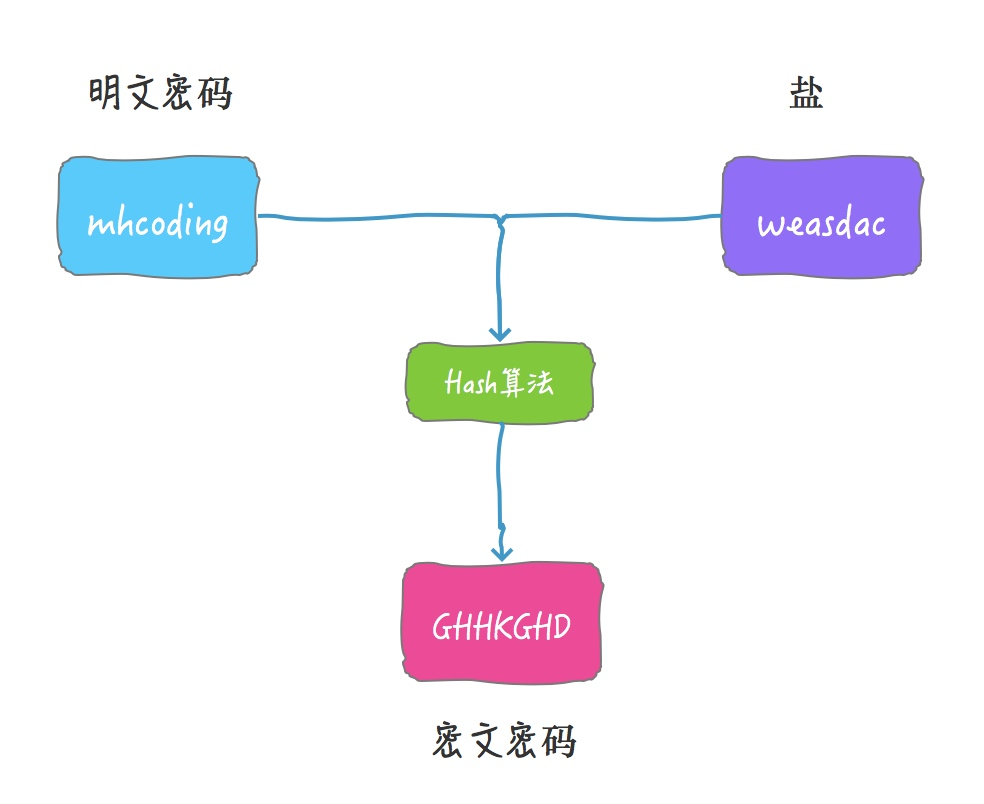

# ✅对称加密和非对称加密有什么区别？

# 典型回答
对称加密，指的是需要对加密和解密使用相同密钥的加密算法。


最简单的对称加密算法就是通过ASCII码的变化进行密码保存，比如把`abcde`转换成`bcdef`，其加密算法就是把ASCII码增加1 。


这种加密算法，有一个特点，就是可以根据加密后得到的密文，再根据密钥还原出明文。


非对称加密，指的是加密和解密使用不同密钥的加密算法，也称为公私钥加密。 


# 扩展知识
### 明文密码


明文密码就是直接可以看懂的，比如`123456`，`admin`等等，而不是经过加密显示出`****`的内容，这种叫做暗码。比如`abc`代表`123`，如果告诉你`abc`而不告诉你解码规则，你就不能翻译出真正的密码`123`。


很多网站都有注册登录功能，对于用户在注册的时候，填写的用户名和密码，如果不经过任何处理直接保存到数据库中，这种情况下，保存的就是用户的明文密码。


这样直接把用户的明文密码保存下来，对于程序开发来说是很方便的。用户在登录的时候直接到数据库中进行账号密码匹配就可以了。但是，同时也埋下了很大的隐患，一旦数据库信息泄露，那么黑客就可以拿到所有用户的用户名和密码。


举个例子，比如用户的明文密码是`helloworld`，加密后的密文是`xxeerrqq`。


用户注册：


```plain
helloworld -> 加密 -> xxeerrqq -> 保存xxeerrqq到数据库中
```


用户登录


```plain
helloworld -> 加密 -> xxeerrqq -> 使用xxeerrqq到数据库中匹配密码
```


密码加密技术经过很多年的发展，已经有了很多成熟的方案，这里就简单介绍几个。


### 对称加密


对称加密，指的是需要对加密和解密使用相同密钥的加密算法。


最简单的对称加密算法就是通过ASCII码的变化进行密码保存，比如把`abcde`转换成`bcdef`，其加密算法就是把ASCII码增加1 。


这种加密算法，有一个特点，就是可以根据加密后得到的密文，再根据密钥还原出明文。


但是，这种算法已经很少有网站在用了，虽然现在有很多方法可以把密钥单独保存，但是，既然黑客可以破解网站拿到用户的密文，就有可能也能获取到密钥。


在对称加密算法中常用的算法有：DES、3DES、TDEA、Blowfish、RC2、RC4、RC5、IDEA、SKIPJACK等。


### 单向Hash算法


单向散列算法，又称hash函数，就是把任意长的输入消息串变化成固定长的输出串的一种函数。一般用于产生消息摘要，密钥加密等。


单向Hash算法是一种无法通过计算还原出原始密码，而且实现比较简单的算法。


很多互联网公司都采用这种方式保存用户密码，曾经这种方式也是比较安全的方式。


常见散列函数(Hash函数)有： MD5（Message Digest Algorithm 5）、 SHA（Secure Hash Algorithm）、 MAC（Message Authentication Code）、 CRC（Cyclic Redundancy Check）


**严格意义上来说，单项哈希算法并不算加密算法，因为像MD5这种算法，他只能加密，没办法解密。**


### 彩虹表


彩虹表(rainbow table)是一个用于加密散列函数逆运算的预先计算好的表，常用于破解加密过的密码散列。 查找表常常用于包含有限字符固定长度纯文本密码的加密。这是以空间换时间的典型实践，在每一次尝试都计算的暴力破解中使用更少的计算能力和更多的储存空间，但却比简单的每个输入一条散列的翻查表使用更少的储存空间和更多的计算性能。


通常情况下，当字段经过散列处理（如MD5），会生成一段散列值，而散列后的值一般是无法通过特定算法得到原始字段的。但是某些情况，比如一个大型的彩虹表，通过在表中搜索该MD5值，很有可能在极短的时间内找到该散列值对应的真实字段内容。


### 加盐Hash算法


盐（Salt），在密码学中，是指在散列之前将散列内容（例如：密码）的任意固定位置插入特定的字符串。这个在散列中加入字符串的方式称为“加盐”。其作用是让加盐后的散列结果和没有加盐的结果不相同，在不同的应用情景中，这个处理可以增加额外的安全性。


加盐后的散列值，可以极大的降低由于用户数据被盗而带来的密码泄漏风险，即使通过彩虹表寻找到了散列后的数值所对应的原始内容，但是由于经过了加盐，插入的字符串扰乱了真正的密码，使得获得真实密码的概率大大降低。





对于加了“固定盐”的Hash算法，需要保护“盐”不能泄露，这就会遇到“保护对称密钥”一样的问题，一旦“盐”泄露，根据“盐”重新建立彩虹表可以进行破解。


### PBKDF2算法


PBKDF2算法，即Password-Based Key Derivation Function 2。PBKDF2简单而言就是将加盐Hash进行多次重复计算，这个次数是可选择的。


该算法原理大致相当于在Hash算法基础上增加**随机盐**，并进行**多次Hash运算**，随机盐使得彩虹表的建表难度大幅增加，而多次Hash也使得建表和破解的难度都大幅增加。


如果计算一次所需要的时间是1微秒，那么计算1百万次就需要1秒钟。假如攻击一个密码所需的彩虹表有1千万条，建立所对应的彩虹表所需要的时间就是115天。这个代价足以让大部分的攻击者忘而生畏。


美国政府机构已经将这个方法标准化，并且用于一些政府和军方的系统。 这个方案最大的优点是标准化，实现容易同时采用了久经考验的SHA算法。


还有很多算法也可以有效抵御彩虹表，常见的有bcrypt、scrypt等。


### bcrypt


bcrypt是专门为密码存储而设计的算法，基于Blowfish加密算法变形而来，由Niels Provos和David Mazières发表于1999年的USENIX。


实现中bcrypt会使用一个加盐的流程以防御彩虹表攻击，同时bcrypt还是适应性函数，它可以借由增加迭代之次数来抵御日益增进的计算机运算能力透过暴力法破解。


由bcrypt加密的文件可在所有支持的操作系统和处理器上进行转移。它的口令必须是8至56个字符，并将在内部被转化为448位的密钥。然而，所提供的所有字符都具有十分重要的意义。密码越强大，您的数据就越安全。


bcrypt经过了很多安全专家的仔细分析，使用在以安全著称的OpenBSD中，一般认为它比PBKDF2更能承受随着计算能力加强而带来的风险。bcrypt也有广泛的函数库支持，因此建议使用这种方式存储密码。


**Java中使用bcrypt**


可以在官网（[http://www.mindrot.org/projects/jBCrypt/](http://www.mindrot.org/projects/jBCrypt/) ）获取该算法的源代码。在Java中，可以直接使用以下方式进行加密：


```plain
public static void main(String[] args) throws NoSuchAlgorithmException

{
    String  originalPassword = "Hollis";
    String generatedSecuredPasswordHash = BCrypt.hashpw(originalPassword, BCrypt.gensalt(12));
    System.out.println(generatedSecuredPasswordHash);

    boolean matched = BCrypt.checkpw(originalPassword, generatedSecuredPasswordHash);

    System.out.println(matched);

}
```


### scrypt


scrypt是由著名的FreeBSD黑客 Colin Percival为他的备份服务 Tarsnap开发的。


设计时考虑到大规模的客制硬件攻击而刻意设计需要大量内存运算。scrypt需要使用大量内存的原因来自于产生大量伪随机性（英语：pseudorandom）资料作为算法计算的基础。一旦这些资料被产生后，算法将会以伪随机性的顺序读取这些资料产生结果。因此最直接的实做方式将会需要大量内存将这些资料储存在内存内供算法计算。


scrypt不仅计算所需时间长，而且占用的内存也多，使得并行计算多个摘要异常困难，因此利用彩虹表进行暴力攻击更加困难。scrypt没有在生产环境中大规模应用，并且缺乏仔细的审察和广泛的函数库支持。但是，scrypt在算法层面只要没有破绽，它的安全性应该高于PBKDF2和bcrypt。


**Java中使用scrypt**


有一个Java实现的scrypt工具类库([https://github.com/wg/scrypt](https://github.com/wg/scrypt) )可以直接使用。用法也比较简单：


```plain
public static void main(String[] args) {

    String originalPassword = "Hollis";

    String generatedSecuredPasswordHash = SCryptUtil.scrypt(originalPassword, 16, 16, 16);
    System.out.println(generatedSecuredPasswordHash);

    boolean matched = SCryptUtil.check("Hollis", generatedSecuredPasswordHash);
    System.out.println(matched);

    matched = SCryptUtil.check("Hollis", generatedSecuredPasswordHash);
    System.out.println(matched);
}
```


> 原文: <https://www.yuque.com/hollis666/xkm7k3/reb5c7>