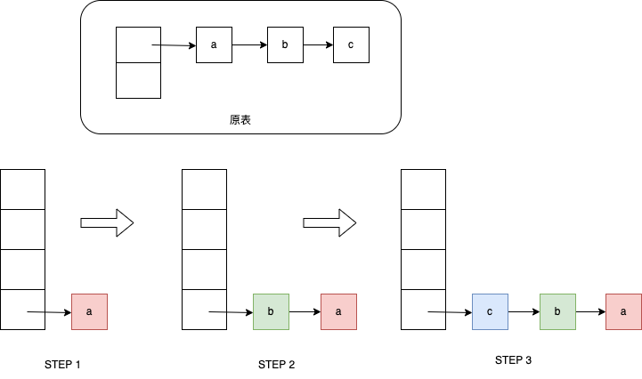
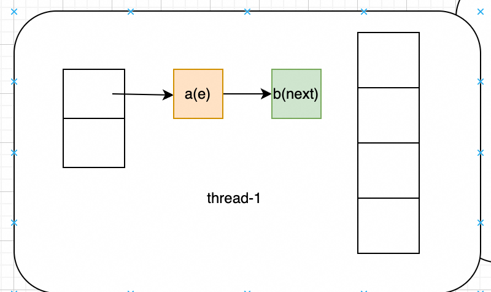
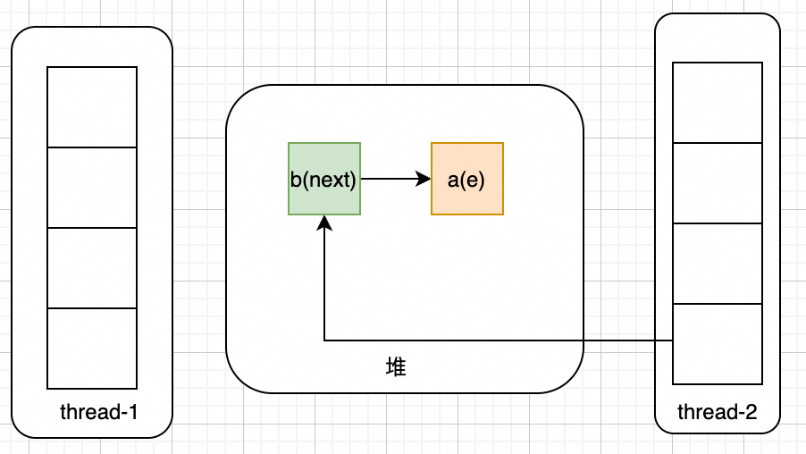
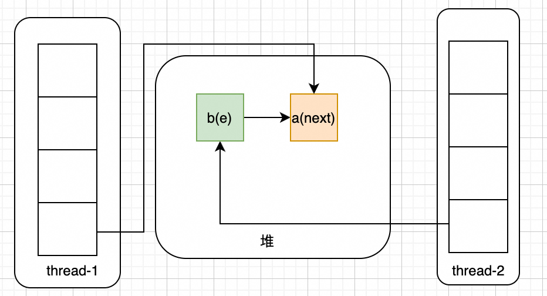
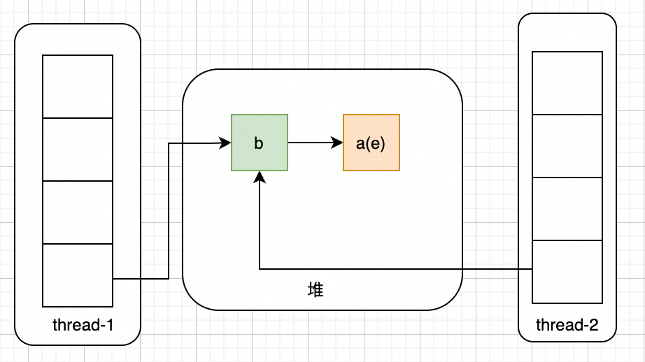
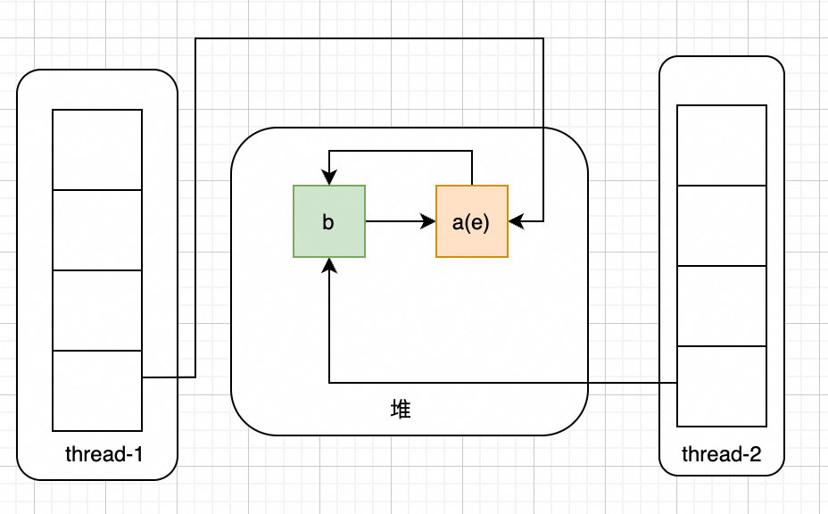

# ✅HashMap用在并发场景中有什么问题？

这是一个非常典型的面试问题，但是只会出现在1.7及以前的版本，1.8之后就被修复了

# 典型回答
## 扩容过程
HashMap在扩容的时候，会将元素插入链表头部，即头插法。如下图，原来是A->B->C，扩容后会变成C->B->A”


如下图所示：




之所以选择使用头插法，是因为JDK的开发者认为，后插入的数据被使用到的概率更高，更容易成为热点数据，而通过头插法把它们放在队列头部，就可以使查询效率更高。


源代码如下：

```java
void transfer(Entry[] newTable) {
    Entry[] src = table;
    int newCapacity = newTable.length;
    for (int j = 0; j < src.length; j++) {
        Entry<K,V> e = src[j];
        if (e != null) {
            src[j] = null;
            do {
                Entry<K,V> next = e.next;
                int i = indexFor(e.hash, newCapacity);
                // 节点直接作为新链表的根节点
                e.next = newTable[i];
                newTable[i] = e;
                e = next;
            } while (e != null);
        }
    }
} 
```

## 并发现象
但是，正是由于直接把当前节点作为链表根节点的这种操作，导致了在多线程并发扩容的时候，产生了循环引用的问题。

假如说此时有两个线程进行扩容，thread-1执行到`Entry<K,V> next = e.next;`的时候被hang住，如下图所示：



此时thread-2开始执行，当thread-2扩容完成后，结果如下：



此时thread-1抢占到执行时间，开始执行：`e.next = newTable[i]; newTable[i] = e; e = next;`后，会变成如下样式：



接着，进行下一次循环，继续执行`e.next = newTable[i]; newTable[i] = e; e = next;`，如下图所示



因为此时e!=null，且e.next = null，开始执行最后一次循环，结果如下：



可以看到，a和b已经形成环状，当下次get该桶的数据时候，如果get不到，则会一直在a和b直接循环遍历，导致CPU飙升到100%

# 知识扩展
## 1.7为什么要将rehash的节点作为新链表的根节点
在重新映射的过程中，如果不将rehash的节点作为新链表的根节点，而是使用普通的做法，遍历新链表中的每一个节点，然后将rehash的节点放到新链表的尾部，伪代码如下：

```java
void transfer(Entry[] newTable) {
    for (int j = 0; j < src.length; j++) {
        Entry<K,V> e = src[j];
        if (e != null) {
            src[j] = null;
            do {
                Entry<K,V> next = e.next;
                int i = indexFor(e.hash, newCapacity);
                // 如果新桶中没有数值，则直接放进去
                if (newTable[i] == null) {
                    newTable[i] = e;
                    continue;
                }
                // 如果有，则遍历新桶的链表
                else {
                    Entry<K,V> newTableEle = newTable[i];
                    while(newTableEle != null) {
                        Entry<K,V> newTableNext = newTableEle.next;
                        // 如果和新桶中链表中元素相同，则直接替换
                        if(newTableEle.equals(e)) {
                            newTableEle = e;
                            break;
                        }
                        newTableEle = newTableNext;
                    }
                    // 如果链表遍历完还没有相同的节点，则直接插入
                    if(newTableEle == null) {
                        newTableEle = e;
                    }
                }
            } while (e != null);
        }
    }
}
```

通过上面的代码我们可以看到，这种做法不仅需要遍历老桶中的链表，还需要遍历新桶中的链表，时间复杂度是O(n^2)，显然是不太符合预期的，所以需要将rehash的节点作为新桶中链表的根节点，这样就不需要二次遍历，时间复杂度就会降低到O(N)

## 1.8是如何解决这个问题的


前面提到，之所以会发生这个死循环问题，是因为在JDK 1.8之前的版本中，HashMap是采用头插法进行扩容的，这个问题其实在JDK 1.8中已经被修复了，改用尾插法！JDK 1.8中的resize代码如下：


```java
final Node<K,V>[] resize() {
    Node<K,V>[] oldTab = table;
    int oldCap = (oldTab == null) ? 0 : oldTab.length;
    int oldThr = threshold;
    int newCap, newThr = 0;
    if (oldCap > 0) {
        if (oldCap >= MAXIMUM_CAPACITY) {
            threshold = Integer.MAX_VALUE;
            return oldTab;
        }
        else if ((newCap = oldCap << 1) < MAXIMUM_CAPACITY &&
                 oldCap >= DEFAULT_INITIAL_CAPACITY)
            newThr = oldThr << 1; // double threshold
    }
    else if (oldThr > 0) // initial capacity was placed in threshold
        newCap = oldThr;
    else {               // zero initial threshold signifies using defaults
        newCap = DEFAULT_INITIAL_CAPACITY;
        newThr = (int)(DEFAULT_LOAD_FACTOR * DEFAULT_INITIAL_CAPACITY);
    }
    if (newThr == 0) {
        float ft = (float)newCap * loadFactor;
        newThr = (newCap < MAXIMUM_CAPACITY && ft < (float)MAXIMUM_CAPACITY ?
                  (int)ft : Integer.MAX_VALUE);
    }
    threshold = newThr;
    @SuppressWarnings({"rawtypes","unchecked"})
        Node<K,V>[] newTab = (Node<K,V>[])new Node[newCap];
    table = newTab;
    if (oldTab != null) {
        for (int j = 0; j < oldCap; ++j) {
            Node<K,V> e;
            if ((e = oldTab[j]) != null) {
                oldTab[j] = null;
                if (e.next == null)
                    newTab[e.hash & (newCap - 1)] = e;
                else if (e instanceof TreeNode)
                    ((TreeNode<K,V>)e).split(this, newTab, j, oldCap);
                else { // preserve order
                    Node<K,V> loHead = null, loTail = null;
                    Node<K,V> hiHead = null, hiTail = null;
                    Node<K,V> next;
                    do {
                        next = e.next;
                        if ((e.hash & oldCap) == 0) {
                            if (loTail == null)
                                loHead = e;
                            else
                                loTail.next = e;
                            loTail = e;
                        }
                        else {
                            if (hiTail == null)
                                hiHead = e;
                            else
                                hiTail.next = e;
                            hiTail = e;
                        }
                    } while ((e = next) != null);
                    if (loTail != null) {
                        loTail.next = null;
                        newTab[j] = loHead;
                    }
                    if (hiTail != null) {
                        hiTail.next = null;
                        newTab[j + oldCap] = hiHead;
                    }
                }
            }
        }
    }
    return newTab;
}

```

## 除了并发死循环，HashMap在并发环境还有啥问题
1. 多线程put的时候，size的个数和真正的个数不一样
2. 多线程put的时候，可能会把上一个put的值覆盖掉
3. 和其他不支持并发的集合一样，HashMap也采用了fail-fast操作，当多个线程同时put和get的时候，会抛出并发异常
4. 当既有get操作，又有扩容操作的时候，有可能数据刚好被扩容换了桶，导致get不到数据


> 原文: <https://www.yuque.com/hollis666/xkm7k3/ph44ot>