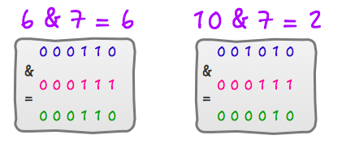
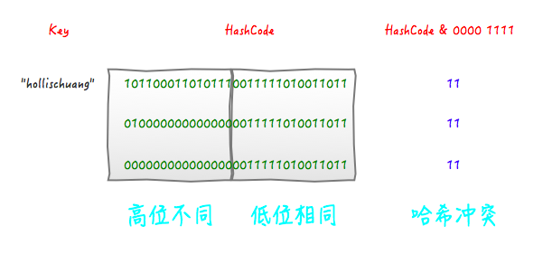
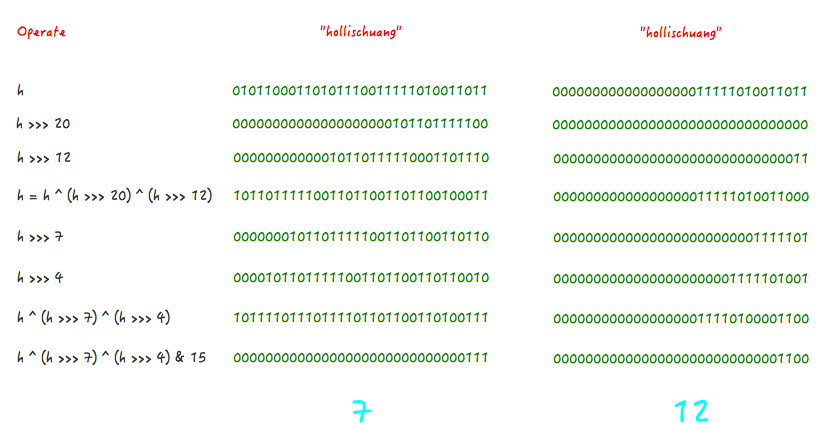

# ✅HashMap的hash方法是如何实现的？

# 典型回答


hash方法的功能是根据Key来定位这个K-V在链表数组中的位置的。也就是hash方法的输入应该是个Object类型的Key，输出应该是个int类型的数组下标。


最简单的话，我们只要调用Object对象的hashCode()方法，该方法会返回一个整数，然后用这个数对HashMap或者HashTable的容量进行取模就行了。只不过，在具体实现上，考虑到效率等问题，HashMap的实现会稍微复杂一点。他的具体实现主要由两个方法int hash(Object k)和int indexFor(int h, int length)来实现的（JDK 1.8中不再单独有indexFor方法，但是在计算具体的table index时也用到了一样的算法逻辑，具体代码可以看putVal方法）。


```javascript
// JDK 1.7中的hash方法
final int hash(Object k) {
    int h = hashSeed;
    if (0 != h && k instanceof String) {
        return sun.misc.Hashing.stringHash32((String) k);
    }

    h ^= k.hashCode();
    h ^= (h >>> 20) ^ (h >>> 12);
    return h ^ (h >>> 7) ^ (h >>> 4);
}

static int indexFor(int h, int length) {
    return h & (length-1);
}


//JDK 1.8中的hash方法
static final int hash(Object key) {
    int h;
    return (key == null) ? 0 : (h = key.hashCode()) ^ (h >>> 16);
}
```


> hash ：该方法主要是将Object转换成一个整型。
>
> indexFor ：该方法主要是将hash生成的整型转换成链表数组中的下标。
>


在这里面，HashMap的hash方法为了提升效率，主要用到了以下技术手段：


1、**使用位运算(&)来代替取模运算(%)**，因为位运算(&)效率要比代替取模运算(%)高很多，主要原因是位运算直接对内存数据进行操作，不需要转成十进制，因此处理速度非常快。

2、对hashcode进行**扰动计算**，防止不同hashCode的高位不同但低位相同导致的hash冲突。简单点说，就是为了把高位的特征和低位的特征组合起来，降低哈希冲突的概率，也就是说，尽量做到任何一位的变化都能对最终得到的结果产生影响。

# 扩展知识


## 使用&代替%运算


不知道，大家有没有想过，为什么可以使用位运算(&)来实现取模运算(%)呢？


这实现的原理如下：


> X % 2^n = X & (2^n - 1)
>
>  
>
> 2^n表示2的n次方，也就是说，一个数对2^n取模 == 一个数和(2^n - 1)做按位与运算 。
>
>  
>
> 假设n为3，则2^3 = 8，表示成2进制就是1000。2^3 -1 = 7 ，即0111。
>
>  
>
> 此时X & (2^3 - 1) 就相当于取X的2进制的最后三位数。
>
>  
>
> 从2进制角度来看，X / 8相当于 X >> 3，即把X右移3位，此时得到了X / 8的商，而被移掉的部分(后三位)，则是X % 8，也就是余数。
>


上面的解释不知道你有没有看懂，没看懂的话其实也没关系，你只需要记住这个技巧就可以了。或者你可以找几个例子试一下。


> 6 % 8 = 6 ，6 & 7 = 6
>
>  
>
> 10 % 8 = 2 ，10 & 7 = 2
>





所以，`return h & (length-1);`只要保证length的长度是`2^n`的话，就可以实现取模运算了。而HashMap中的length也确实是2的幂，初始值是16，之后每次扩充为原来的2倍。


[✅为什么HashMap的Cap是2^n，如何保证？](https://www.yuque.com/hollis666/xkm7k3/ud3e99)


总结一下，HashMap的数据是存储在链表数组里面的。在对HashMap进行插入/删除等操作时，都需要根据K-V对的键值定位到他应该保存在数组的哪个下标中。而这个通过键值求取下标的操作就叫做哈希。HashMap的数组是有长度的，Java中规定这个长度只能是2的幂，初始值为16。简单的做法是先求取出键值的hashcode，然后在将hashcode得到的int值对数组长度进行取模。为了考虑性能，Java总采用按位与操作实现取模操作。


[✅为什么按位与运算要比取模运算高效？](https://www.yuque.com/hollis666/xkm7k3/rgo8x0s28bgg46kd)


其实，使用位运算代替取模运算，除了性能之外，还有一个好处就是可以很好的解决负数的问题。因为我们知道，hashcode的结果是int类型，而int的取值范围是-2^31 ~ 2^31 - 1，即[ -2147483648, 2147483647]；这里面是包含负数的，我们知道，对于一个负数取模还是有些麻烦的。如果使用二进制的位运算的话就可以很好的避免这个问题。首先，不管hashcode的值是正数还是负数。length-1这个值一定是个正数。那么，他的二进制的第一位一定是0（有符号数用最高位作为符号位，“0”代表“+”，“1”代表“-”），这样里两个数做按位与运算之后，第一位一定是个0，也就是，得到的结果一定是个正数。

## 扰动计算


其实，无论是用取模运算还是位运算都无法直接解决冲突较大的问题。


比如：`CA11 0000`和`0001 0000`在对`0000 1111`进行按位与运算后的值是相等的。 


两个不同的键值，在对数组长度进行按位与运算后得到的结果相同，这不就发生了冲突吗。那么如何解决这种冲突呢，来看下Java是如何做的。


其中的主要代码部分如下：


```plain
h ^= k.hashCode();
h ^= (h >>> 20) ^ (h >>> 12);
return h ^ (h >>> 7) ^ (h >>> 4);
```


这段代码是为了对key的hashCode进行**扰动计算**，防止不同hashCode的高位不同但低位相同导致的hash冲突。简单点说，就是为了把高位的特征和低位的特征组合起来，降低哈希冲突的概率，也就是说，尽量做到任何一位的变化都能对最终得到的结果产生影响。


举个例子来说，我们现在想向一个HashMap中put一个K-V对，Key的值为“hollischuang”，经过简单的获取hashcode后，得到的值为“1011000110101110011111010011011”，如果当前HashTable的大小为16，即在不进行扰动计算的情况下，他最终得到的index结果值为11。由于15的二进制扩展到32位为“00000000000000000000000000001111”，所以，一个数字在和他进行按位与操作的时候，前28位无论是什么，计算结果都一样（因为0和任何数做与，结果都为0）。如下图所示。





可以看到，后面的两个hashcode经过位运算之后得到的值也是11 ，虽然我们不知道哪个key的hashcode是上面例子中的那两个，但是肯定存在这样的key，这就产生了冲突。


那么，接下来，我看看一下经过扰动的算法最终的计算结果会如何。




从上面图中可以看到，之前会产生冲突的两个hashcode，经过扰动计算之后，最终得到的index的值不一样了，这就很好的避免了冲突。


> 原文: <https://www.yuque.com/hollis666/xkm7k3/sz24zwwrdg92qizg>