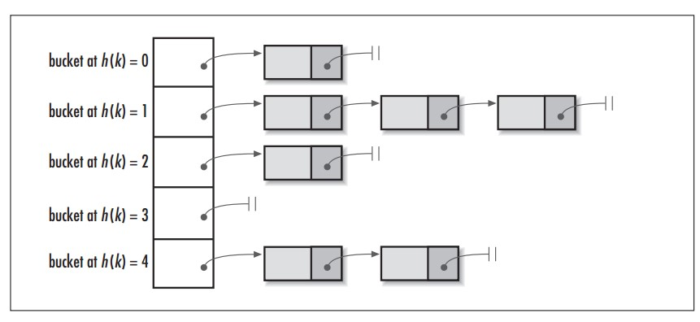

# ✅HashMap的数据结构是怎样的？

### HashMap 的数据结构

在Java中，保存数据有两种比较简单的数据结构：数组和链表。

****

**数组的特点是：寻址容易，插入和删除困难；而链表的特点是：寻址困难，插入和删除容易。**

**常用的哈希函数的冲突解决办法中有一种方法叫做链地址法，其实就是将数组和链表组合在一起，发挥了两者的优势，我们可以将其理解为链表的数组。在JDK 1.8之前，HashMap就是通过这种结构来存储数据的。**

我们可以从上图看到，左边很明显是个数组，数组的每个成员是一个链表。该数据结构所容纳的所有元素均包含一个指针，用于元素间的链接。我们根据元素的自身特征把元素分配到不同的链表中去，反过来我们也正是通过这些特征找到正确的链表，再从链表中找出正确的元素。其中，根据元素特征计算元素数组下标的方法就是哈希算法，即本文的主角hash()函数（当然，还包括indexOf()函数）。

在JDK 1.8中为了解决因hash冲突导致某个链表长度过长，影响put和get的效率，引入了红黑树。

[✅为什么在JDK8中HashMap要转成红黑树](https://www.yuque.com/hollis666/xkm7k3/zx609g)

> 原文: <https://www.yuque.com/hollis666/xkm7k3/klz889cad0dpv2am>