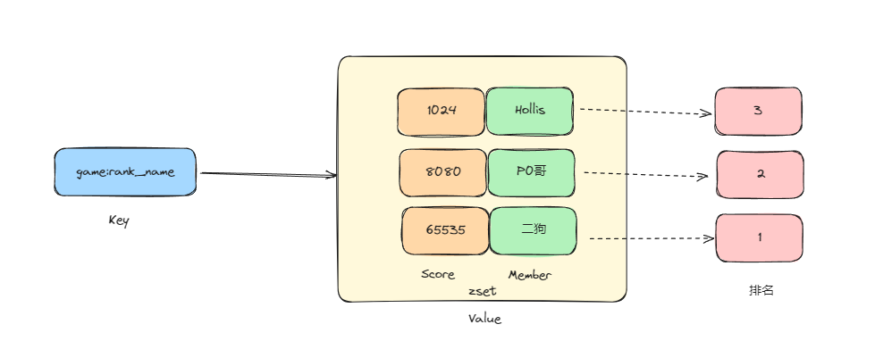

# ✅基于Redis的zset实现秒级排行榜

### 背景
假设我们有一个在线游戏平台，需要为每个游戏的玩家实现排行榜功能，以显示每个游戏的最高得分排名。


### 技术选型


在这个场景中，主要就是实现排行榜，对于排行榜，有很多种。


有周榜、日榜、小时榜以及分钟榜等，不同的排行榜可以采用不同的技术方案实现。


对于周榜、日榜、小时榜等，完全可以基于定时任务、离线任务等生成，直接统计数据然后做排序就行了，难度不大。


难度比较大的就是分钟级或者秒级的榜单的实现。


对于这种榜单，比较好的办法就是脱离数据库，直接用redis来实现，因为数据库的话大量数据的order by会性能很差。


借助redis的zset我们可以非常方便的实现排行榜的功能。


### 你做了什么


zset允许我们将每个玩家的得分作为score存储，并使用玩家的唯一标识符作为成员，利用zset自身的基于score排序的功能，我们就能很快实现这个排行榜的功能。





借助Redis，我们可以实现以下几个方法：


1、新用户加入排名：


```java
// 新用户加入排名
private static void joinLeaderboard(Jedis jedis, String user, double score) {
    jedis.zadd("game:1_ranking", score, user);
}
```


> <font style="color:rgb(51, 51, 51);">zadd 命令用于将一个或多个成员元素及其分数值加入到有序集当中。</font>
>
> <font style="color:rgb(51, 51, 51);">如果某个成员已经是有序集的成员，那么更新这个成员的分数值，并通过重新插入这个成员元素，来保证该成员在正确的位置上。</font>
>
> <font style="color:rgb(51, 51, 51);">分数值可以是整数值或双精度浮点数</font>
>
> <font style="color:rgb(51, 51, 51);">如果有序集合 key 不存在，则创建一个空的有序集并执行 ZADD 操作。</font>
>


2、用户积分增加：


```java
// 用户积分增加
private static void increaseUserScore(Jedis jedis, String user, double score) {
    jedis.zincrby("game:1_ranking", score, user);
}
```


> <font style="color:rgb(51, 51, 51);">zincrby 命令对有序集合中指定成员的分数加上增量 </font>
>
> <font style="color:rgb(51, 51, 51);">可以通过传递一个负数值 ，让分数减去相应的值，比如 ZINCRBY key -5 member ，就是让 member 的 score 值减去 5 。</font>
>
> <font style="color:rgb(51, 51, 51);">当 key 不存在，或分数不是 key 的成员时， ZINCRBY key increment member 等同于 ZADD key increment member 。</font>
>
> <font style="color:rgb(51, 51, 51);">当 key 不是有序集类型时，返回一个错误。</font>
>
> <font style="color:rgb(51, 51, 51);">分数值可以是整数值或双精度浮点数。</font>
>


3、获取前N名玩家：


```java
// 获取前N名玩家
private static Set<Tuple> getTopPlayers(Jedis jedis, int n) {
    return jedis.zrevrangeWithScores("game:1_ranking", 0, n - 1);
}
```


> zrevrangeWithScores是Jedis提供的一个方法，是按照分值排序取出后N名。
>


有了这三个方法，我们就可以根据需要调用这些函数来实现用户积分的增加、新用户的加入排名和获取前十名玩家的功能。


### 进一步优化


如果，现在我想实现一个新的功能，当用户的积分一样时，按照用户的创建时间来排序，也就是说，如果两个人分数相同，1.1日开通的用户必1.2日开通的用户排名靠前。


要实现这个功能，不要按照分数查询之后再排序，太麻烦了，直接用redis就能干。


为了实现分数相同按照时间顺序排序，**我们可以将分数score设置为一个浮点数，其中整数部分为积分，小数部分为开通的时间戳**，如下所示：


> score = 分数 + 1-时间戳/1e13
>
> 因为时间戳是这种形式1708746590000 ，共有13位，而1e13是10000000000000，即1后面13个0，所以用时间戳/1e13就能得到一个小数
>


这样可以保证分数相同时，按照时间戳从小到大排序，即先得分的先被排在前面。


我们只需要在用户初始化时，把这部分加进去就行了：


```java
// 新用户加入排名
private static void joinLeaderboard(Jedis jedis, String user, double score, long openTimestamp) {
    double final_score = score + 1 - timestamp / 1e13;
    jedis.zadd("game:1_ranking", final_score, user);
}
```


### 学习资料


[✅Redis中的Zset是怎么实现的？](https://www.yuque.com/hollis666/xkm7k3/uzqztzuicddlk95c)


[✅为什么ZSet 既能支持高效的范围查询，还能以 O(1) 复杂度获取元素权重值？](https://www.yuque.com/hollis666/xkm7k3/cswc0lcmh3wsbfp9)


[✅Redis的zset实现排行榜，实现分数相同按照时间顺序排序，怎么做？](https://www.yuque.com/hollis666/xkm7k3/ooqi2qfep22bcpag)


> 原文: <https://www.yuque.com/hollis666/xkm7k3/krlg7kes395enbdv>