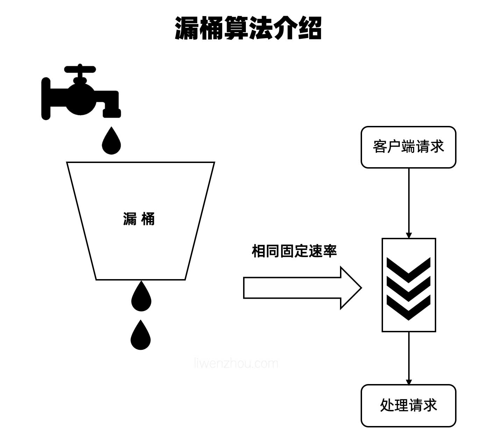
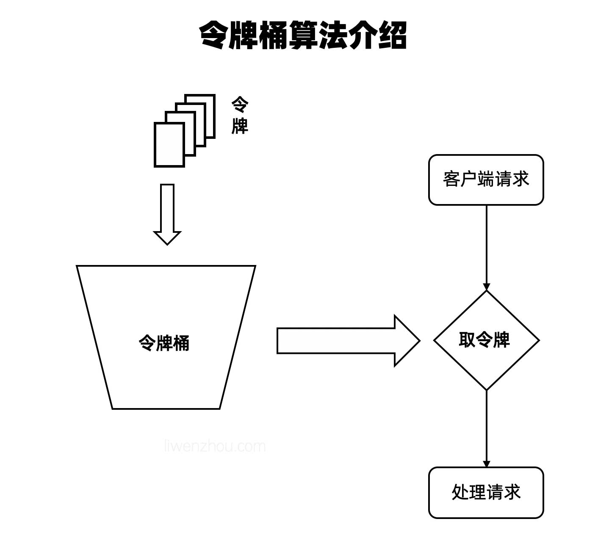

# ✅漏桶和令牌桶有啥区别？

# 典型回答

漏桶和令牌桶都是用来做流量控制的算法。经常会有人把他们放在一起对比。

他们之间的关系是都有一个固定容量的桶，都是按照固定的速率向桶中添加水（或者令牌），但是他们有一个最大的区别，那就是<u>漏桶的这个桶底部是漏的</u>，它同样会按照固定的速率把水流出，所以漏桶输出流量是匀速的，不管输入流量如何变化。而令牌桶的底部不是漏的，他不会以固定的速率流出，只会以固定的速率向桶中添加令牌。

以上就是二者的差别。举个例子：

漏桶的这个桶，一秒钟流入一滴水，同样一秒钟漏出一滴水。那么，一秒钟就只能处理一个请求，超过的请求会被拒绝掉，达到限流的效果。

也就是说，漏桶这种算法，在5秒钟只能可以处理5个请求，并且每秒钟一个。但是如果出现这种情况，前4秒钟都没有请求，第5秒同时来了5个请求，漏桶是无法处理5个请求的，他只能处理1个，因为这一秒钟只会有一滴水漏出来。

这就是典型的突发流量的问题。而令牌桶可以很好的解决这个问题。

令牌桶的实现逻辑是同样1秒钟产生一个令牌放到桶中，但是如果这个令牌没有被消费的话，他就会一直在桶中，不会被漏出去。还是刚刚那个例子，前4秒没有请求要处理的话，那么5秒钟就可以积攒5个令牌，这时候第5秒来了5个请求的时候，他去桶中是可以一次取出5个令牌，然后把这5个请求都给处理掉的。这就很好地应对了突发力量的问题。

**所以，漏桶算法适合于需要限制数据的平均传输速率并确保数据传输的平滑性的场景。令牌桶算法更加灵活，适合于那些既需要限制数据平均传输速率，又需要允许一定程度突发传输的场景。**

# 扩展知识

## 漏桶算法

漏桶算法是一种流量控制算法，可以平滑控制流量的进出，原理比较简单：假设我们有一个水桶按固定的速率向下方滴落一滴水，无论有多少请求，请求的速率有多大，都按照固定的速率流出，对应到系统中就是按照固定的速率处理请求。

漏桶算法通过一个固定容量的漏桶来控制请求的处理速率，每个请求被看作是一定数量的水，需要先放到漏桶中。当漏桶满时，请求将被拒绝或延迟处理，从而保证了系统的稳定性。

漏桶通过定时器的方式将水以恒定的速率流出，与请求的数量无关，从而平滑控制了请求的处理速率。当请求到来时，先将请求看作是一定数量的水，需要将这些水放入漏桶中。

如果漏桶未满，请求将被立即处理并从漏桶中取出对应数量的水。如果漏桶已满，请求将被拒绝或被延迟处理，直到漏桶中有足够的空间存放请求对应数量的水。

当定时器触发时，漏桶中的水以恒定的速率流出，此时可以继续处理请求。

总之，**漏桶算法通过一个固定容量的漏桶来控制请求的处理速率，可以平滑控制流量的进出，保证系统的稳定性和安全性。**

但需要注意的是，**漏桶算法无法处理突发流量**，因为他只能按照固定的速度来处理请求，如果某个请求的流量突增，因为漏桶的机制就导致了他还是只能一个一个的按照固定速度进行消费。

为了解决这种突发流量的问题，就有了**令牌桶算法**。

## 令牌桶算法

令牌桶其实和漏桶的原理类似，**令牌桶按固定的速率往桶里放入令牌，并且只要能从桶里取出令牌就能通过。**

也就是说，我不管现在请求量是多还是少，都有一个线程以固定的速率再往桶里放入令牌，而有请求过来的时候，就会去桶里取出令牌，能取到就执行，取不到就拒绝或者阻塞。

令牌桶通过定时器的方式向桶中添加令牌，每秒钟添加一定数量的令牌，从而平滑控制了请求的处理速率。这样如果突发流量过来了，只要令牌桶中还有足够的令牌，就可以快速的执行，而不是像漏桶一样还要按照固定速率执行。

令牌桶的好处就是把流量给平滑掉了，在流量不高的时候也会不断的向桶中增加令牌，这样就有足够的令牌可供请求消费。

**在Java中，我们可以借助Guava提供的RateLimiter来实现令牌桶。**

> 原文: <https://www.yuque.com/hollis666/xkm7k3/pnv0aynzyongiuiz>