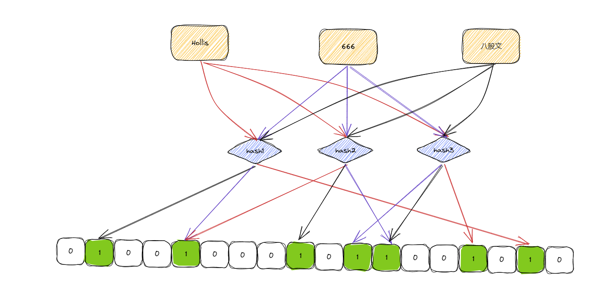
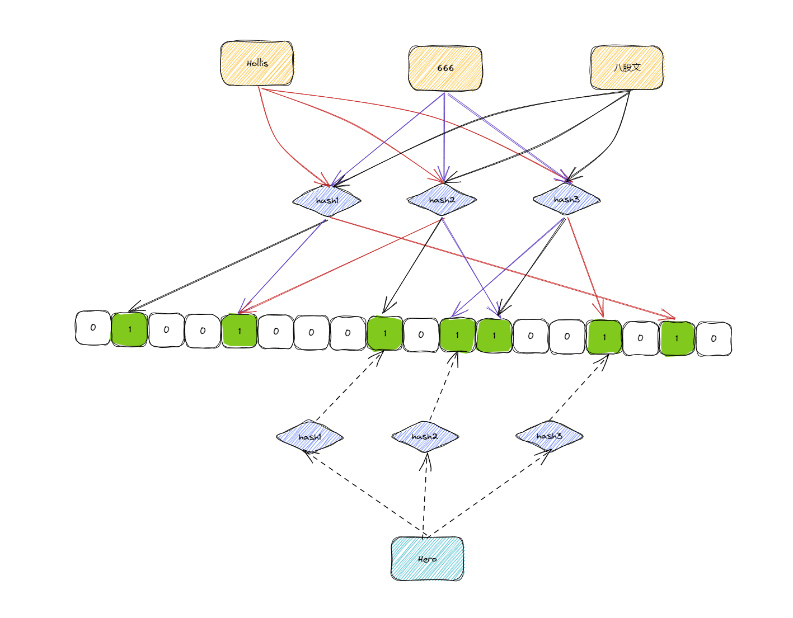

# ✅什么是布隆过滤器，实现原理是什么？


# 典型回答


布隆过滤器是一种数据结构，用于快速检索一个元素是否可能存在于一个集合(bit 数组)中。


它的基本原理是利用多个哈希函数，将一个元素映射成多个位，然后将这些位设置为 1。当查询一个元素时，如果这些位都被设置为 1，则认为元素**<u>可能</u>**存在于集合中，否则**<u>肯定</u>**不存在。


所以，布隆过滤器可以准确的判断一个元素是否一定不存在，但是因为哈希冲突的存在，所以他没办法判断一个元素一定存在。只能判断可能存在。





所以，布隆过滤器是存在误判的可能的，也就是当一个不存在的Hero元素，经过hash1、hash2和hash3之后，刚好和其他的值的哈希结果冲突了。那么就会被误判为存在，但是其实他并不存在。





想要降低这种误判的概率，主要的办法就是降低哈希冲突的概率及引入更多的哈希算法。


下面是布隆过滤器的工作过程：


1. 初始化布隆过滤器

在初始化布隆过滤器时，需要指定集合的大小和误判率。布隆过滤器内部包含一个bit数组和多个哈希函数，每个哈希函数都会生成一个索引值。


2. 添加元素到布隆过滤器

要将一个元素添加到布隆过滤器中，首先需要将该元素通过多个哈希函数生成多个索引值，然后将这些索引值对应的位设置为 1。如果这些索引值已经被设置为 1，则不需要再次设置。


3. 查询元素是否存在于布隆过滤器中

要查询一个元素是否存在于布隆过滤器中，需要将该元素通过多个哈希函数生成多个索引值，并判断这些索引值对应的位是否都被设置为 1。如果这些位都被设置为 1，则认为元素可能存在于集合中，否则肯定不存在。


布隆过滤器的主要优点是可以快速判断一个元素是否属于某个集合，并且可以在空间和时间上实现较高的效率。但是，它也存在一些**缺点**，例如：


1. 布隆过滤器在判断元素是否存在时，有一定的**误判率**。
2. 布隆过滤器**无法删除元素**，因为删除一个元素需要将其对应的多个位设置为 0，但这些位可能被其他元素共享。


# 扩展知识


## 应用场景


布隆过滤器因为他的效率非常高，所以被广泛的使用，比较典型的场景有以下几个：


1. 网页爬虫：爬虫程序可以使用布隆过滤器来过滤掉已经爬取过的网页，避免重复爬取和浪费资源。
2. 缓存系统：缓存系统可以使用布隆过滤器来判断一个查询是否可能存在于缓存中，从而减少查询缓存的次数，提高查询效率。布隆过滤器也经常用来解决缓存穿透的问题。
3. 分布式系统：在分布式系统中，可以使用布隆过滤器来判断一个元素是否存在于分布式缓存中，避免在所有节点上进行查询，减少网络负载。
4. 垃圾邮件过滤：布隆过滤器可以用于判断一个邮件地址是否在垃圾邮件列表中，从而过滤掉垃圾邮件。
5. 黑名单过滤：布隆过滤器可以用于判断一个IP地址或手机号码是否在黑名单中，从而阻止恶意请求。


## 如何使用


Java中可以使用第三方库来实现布隆过滤器，常见的有Google Guava库和Apache Commons库以及Redis。


如Guava：


```plain
import com.google.common.hash.BloomFilter;
import com.google.common.hash.Funnels;

public class BloomFilterExample {
    public static void main(String[] args) {
        // 创建布隆过滤器，预计插入100个元素，误判率为0.01
        BloomFilter<String> bloomFilter = BloomFilter.create(Funnels.stringFunnel(), 100, 0.01);

        // 插入元素
        bloomFilter.put("Hollis");
        bloomFilter.put("666");
        bloomFilter.put("八股文");

        // 判断元素是否存在
        System.out.println(bloomFilter.mightContain("Hollis")); // true
        System.out.println(bloomFilter.mightContain("王星星"));  // false
    }
}

```


Apache Commons：


```plain
import org.apache.commons.lang3.StringUtils;
import org.apache.commons.collections4.BloomFilter;
import org.apache.commons.collections4.functors.HashFunctionIdentity;

public class BloomFilterExample {
    public static void main(String[] args) {
        // 创建布隆过滤器，预计插入100个元素，误判率为0.01
        BloomFilter<String> bloomFilter = new BloomFilter<>(HashFunctionIdentity.hashFunction(StringUtils::hashCode), 100, 0.01);

        bloomFilter.put("Hollis");
        bloomFilter.put("666");
        bloomFilter.put("八股文");

        // 判断元素是否存在
        System.out.println(bloomFilter.mightContain("Hollis")); // true
        System.out.println(bloomFilter.mightContain("王星星"));  // false
    }
}

```


Redis中可以通过Bloom模块来使用，使用Redisson可以：


```plain
Config config = new Config();
config.useSingleServer().setAddress("redis://127.0.0.1:6379");

RedissonClient redisson = Redisson.create(config);
RBloomFilter<String> bloomFilter = redisson.getBloomFilter("myfilter");
bloomFilter.tryInit(100, 0.01);
bloomFilter.add("Hollis");
bloomFilter.add("666");
bloomFilter.add("八股文");
System.out.println(bloomFilter.contains("Hollis"));
System.out.println(bloomFilter.contains("王星星"));
redisson.shutdown();
```


首先创建一个RedissonClient对象，然后通过该对象获取一个RBloomFilter对象，使用tryInit方法来初始化布隆过滤器，**指定了能添加的元素数量为100，误判率为0.01**。然后，使用add方法将元素"Hollis"、"666"和"八股文"添加到布隆过滤器中，使用contains方法来检查元素是否存在于布隆过滤器中。


或者Jedis也可以：


```plain
Jedis jedis = new Jedis("localhost");
jedis.bfCreate("myfilter", 100, 0.01);
jedis.bfAdd("myfilter", "Hollis");
jedis.bfAdd("myfilter", "666");
jedis.bfAdd("myfilter", "八股文");
System.out.println(jedis.bfExists("myfilter", "Hollis"));
System.out.println(jedis.bfExists("myfilter", "王星星"));
jedis.close();

```


我们在实现布隆过滤器器的时候，**都需要传入容量和误判率这两个参数，根据这些参数，会计算出需要的位数组大小和哈希函数数量。使得元素存入时能满足我们要求的误判率。**

****

但是需要注意，这个容量并不是说存满了就不能继续存了，还可以继续存入，只不过随着添加到布隆过滤器中的元素数量接近或超过预期的容量，误判率会增加。（这个很好理解，bit 的位置是有限的，数量越多，存入的时候冲突就越高了）

****

****


> 原文: <https://www.yuque.com/hollis666/xkm7k3/gp9ymie1n39uavah>